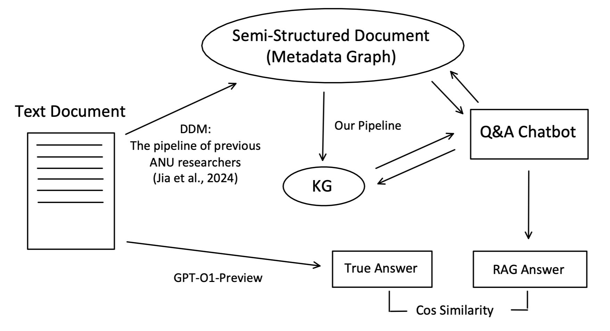
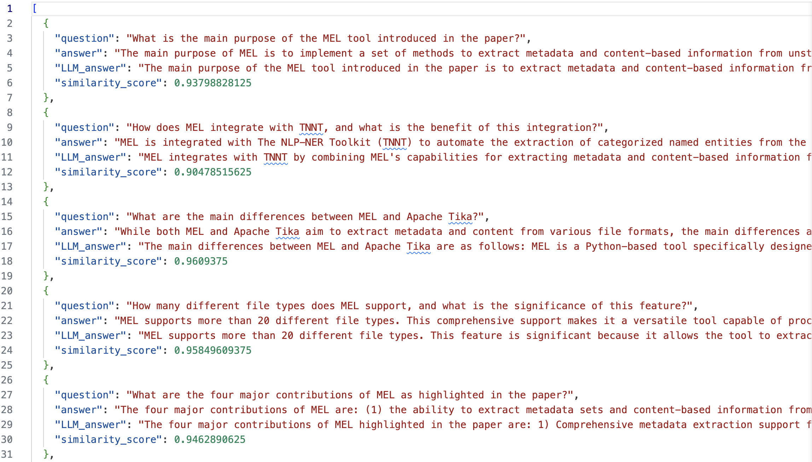

## Evaluation via Application

### Overview

The second evaluation approach is inspired by how previous research has tested their constructed Knowledge Graphs (KGs). This approach leverages one of the largest applications of KGs: Retrieval-Augmented Generation (RAG).

In a typical RAG system, a chatbot—usually implemented as a Large Language Model (LLM) decoder—answers user queries. Instead of relying solely on its pre-existing knowledge, the RAG system first searches a knowledge base for relevant sources. The retrieved sources are then provided as contextual hints, along with the original user query, to help the chatbot generate a more accurate response.

Traditionally, these sources are in the form of text documents. However, KGs can also serve as the knowledge base for retrieval, potentially offering better performance due to their structured nature.

By evaluating the RAG system based on our constructed KGs, we can indirectly assess the quality of our KGs and, consequently, our Knowledge Graph Construction (KGC) pipeline.

### Challenges

A major challenge of this approach is the need to build an RAG system on top of our KGC pipeline. Graph-based RAG is a distinct field of study parallel to KGC, requiring additional expertise. Furthermore, neither the Five-Full-Paper dataset nor SciERC provides question-answer pairs as ground truth.

### Evaluation Approach

To address this, we created a simple RAG system for evaluation. To obtain question-answer pairs, we utilized one of the most advanced LLMs, `gpt-o1-preview`. This model is more sophisticated but also more costly than the models we currently use (`Meta-Llama-3-8B-Instruct-Q4-0` and `gpt-4o-mini`).

Specifically, we first let `gpt-o1-preview` read the entire document for each paper in the Five-Full-Paper dataset. Given its large 128K token input limit, this is feasible. We then prompted it to generate 10 question-answer pairs per document. These pairs serve as inputs and expected outputs for evaluating our RAG system.

Since these question-answer pairs are generated by an advanced LLM that has read the entire document, they are expected to be highly accurate.

On the RAG side, our system retrieves relevant facts from the constructed KG to answer questions. We limit the number of hops the system can query from an entity node related to the question, ensuring that only the most relevant information is retrieved.

Due to the brevity of papers in SciERC, this evaluation approach is applied only to the Five-Full-Paper dataset.

### Prompt for Generating Question-Answer Pairs

```plaintext
## Task
You are a university teacher who has assigned your students to read an academic paper.
To test their understanding, you will prepare 10 questions that can only be answered
by referring to the paper. Your questions should be objective, meaning each question should
have a clear, concrete answer without the need for subjective interpretation.
You should also provide a sample answer for each question.
```

We framed the prompt as a university teacher creating test questions, as reading academic papers is a common activity in academia. The instruction that questions should be “only answerable by referring to the paper” ensures that our chatbot does not rely on common knowledge, which would undermine our evaluation. Additionally, specifying that questions should be objective prevents the LLM from generating opinion-based questions.

### RAG System Implementation

To evaluate the effectiveness of our KGs, we implemented both a text-based RAG and a graph-based RAG for direct comparison.

#### **Text-Based RAG**

```plaintext
Input: A question regarding the paper
       A semi-structured paper (same as the input of our pipeline)

Output: An answer

[BGE] Embed all sentences in the input paper.
[BGE] Embed the question.
Retrieve the 10 most relevant sentences from the input paper based on embedding similarity.
[LLaMA Prompt_1] Given the question and the 10 most relevant sentences, generate an answer.
```

#### **Graph-Based RAG**

```plaintext
Input: A question
       The KG of a paper (same as the output of our pipeline)

Output: An answer

[M3] Embed all entities in the KG based on their labels.
[LLaMA Prompt_2] Extract all keywords from the question.
Embed all keywords.

For each keyword:
    - Find the closest entity in the KG and store it.

For each relevant entity:
    - Retrieve all one-hop triples that involve the entity and store them.
    - If a triple contains an entity not yet stored, add it.

[LLaMA Prompt_3] Given the list of relevant triples, entity labels, aliases, descriptions,
and the original question, generate an answer.
```

#### **Prompt for Graph-Based RAG Answer Generation**

```plaintext
## Task
You are a helpful assistant answering questions about an academic paper.
Given a question and extracted resources from the knowledge graph of the paper,
your task is to generate an answer. You are provided with a list of relevant entities
and (subject, predicate, object) triples describing their relations.
```

We also provide entity descriptions when supplying triples to mitigate potential ambiguity.

### Why Compare Text-Based and Graph-Based RAG?

The text-based RAG serves as a baseline to determine how well a paper's content—without deep structured knowledge—performs in RAG. If text-based retrieval alone suffices, it raises questions about the necessity of building detailed KGs. This comparison helps evaluate whether KGs provide substantial benefits over a simpler metadata graph.

### Evaluation Metric

Finally, we measure the similarity between the answers generated by our RAG system and the ground truth answers.

### Evaluation Process Diagram



This diagram illustrates the overall process of evaluating KGs through their application in an RAG system.

### Example Results

Figure below shows sample question-answer tuples with similarity scores:



### Remarks

This evaluation approach assesses both the **precision** and **recall** of the KG since the questions directly pertain to the documents. For the KG to enable correct answers, it must capture document information precisely and comprehensively.

However, as with the **Evaluation via Reverse Engineering** approach, this method does not test the KGC pipeline in isolation. Both the KGC pipeline and the RAG system influence overall performance.

Additionally, this evaluation examines the **conciseness** of the KG, particularly the effectiveness of **Coreference Resolution and Entity Disambiguation**.

For instance, if the term "ANU" appears in a question, our RAG system retrieves only the closest-matching entity. If "The Australian National University" and "ANU" are not merged correctly, relevant information about "The Australian National University" will not be retrieved.

Therefore, even if a KG scores highly in **Evaluation via Reverse Engineering**, poor coreference resolution may result in lower performance in **Evaluation via Application**.

