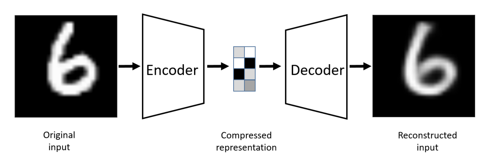
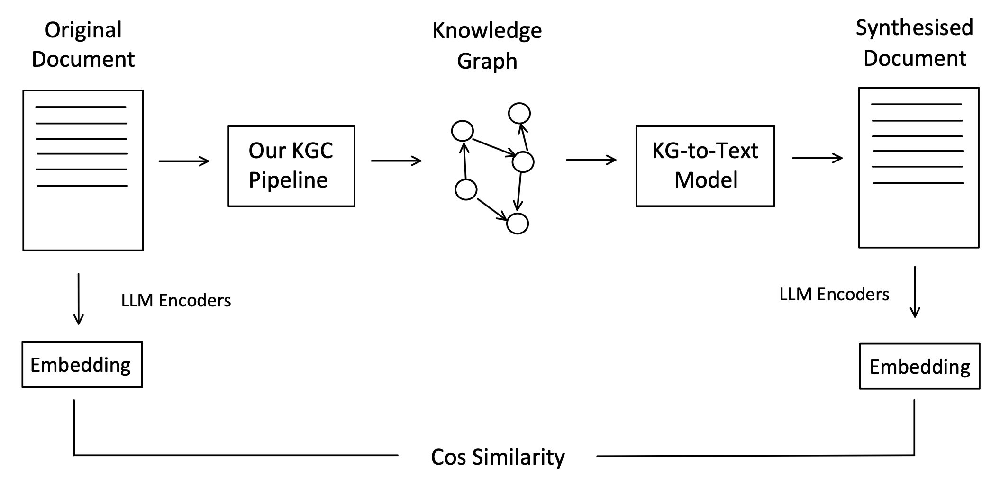
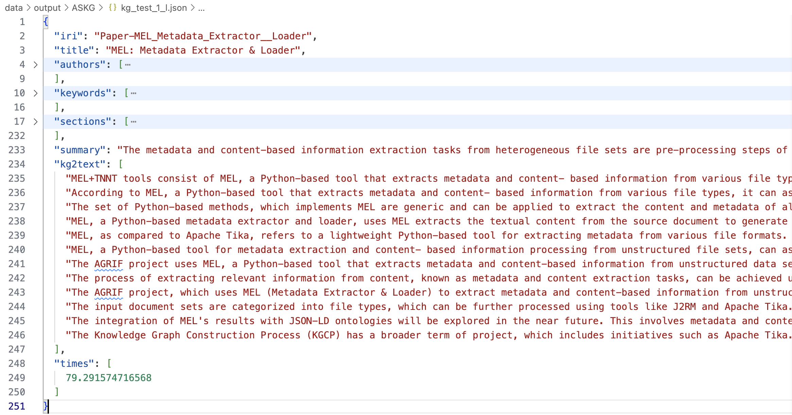

## Evaluation via Reverse Engineering

The last part of the evaluation mainly focuses on the shallow features of the knowledge graphs (KGs). While these are important, they are not sufficient. From this section onward, the evaluation is directly based on the quality of the constructed KGs.

A key challenge in evaluating KG quality is the lack of reference datasets, as most datasets are unlabelled. Although SciERC is labeled, it does not contain full papers, and the targeted KGs in the dataset are constructed using traditional knowledge graph completion (KGC) methods.

The first evaluation approach is inspired by how autoencoder models are trained and tested.


*Figure 1: Structure of an Auto-encoder*

An autoencoder takes a source as input and converts it into a compressed representation through its encoder, also known as the feature extractor. It then attempts to reconstruct the original source from this compressed representation. By comparing the original and synthesized versions, we can assess how well the feature extractors and decoder perform. A good autoencoder should capture the key features of the input, enabling reconstruction with minimal loss.

Similarly, our KGC pipeline can be viewed as the encoder part of an autoencoder, where the compressed representation is the KG. If we have a model that converts KGs back into text, we can evaluate both the pipeline and the KG-to-Text model by comparing the similarity between the original and synthesized documents. A common way to measure similarity between documents is by comparing the cosine similarity of their embeddings, which represent the key features of the text.

In fact, KG-to-Text is an important field of study that runs parallel to KGC within the broader KG domain. Due to the complexity of KG-to-Text research, we implemented a straightforward approach to convert KGs back into text documents for evaluation purposes.


*Figure 2: Evaluation via Reverse Engineering*

---

## Evaluation Approach

This approach is commonly considered a baseline in KG-to-Text studies, as noted in various survey articles. The method involves using a large language model (LLM) decoder to concatenate all (Subject, Predicate, Object) triples from the constructed KG.

As an enhancement to the baseline, we process triples in batches, prioritizing the most relevant ones to ensure that key knowledge appears earlier in the text, aligning with academic writing conventions. Additionally, when concatenating triples, we provide the LLM with descriptions of the involved entities. The relevance of a triple is determined by summing the relevance scores of its subject and object entities, calculated via cosine similarity between their embeddings and the document embeddings. This process is already performed in Stage 8: Global Relation Extraction.

### KG-to-Text Algorithm

```text
Input: KG
Output: Text Document

For each triple in the KG,
    calculate its relevance score based on the sum of the relevance 
    scores of its subject entity and its object entity.

Sort the triples by their relevance scores.

For each batch of 20 triples in the KG,
    retrieve all entities involved in these triples.
    
    [LLaMA Prompt_1] Given a list of (subject, predicate, object) 
    triples in a graph, along with the label, aliases, and description of 
    all entities involved, prompt the LLM to generate a paragraph 
    describing these triples.

    Append the generated paragraph to the output document.
```

### Prompt 1 (Simplified)

```text
## Task Definition

You are a linguistic expert involved in knowledge-graph-to-text 
generation. Given a list of (subject, predicate, object) triples, along 
with the label, aliases, and description of all entities involved, your 
task is to generate a fluent paragraph describing these triples.

You may use the information about entities for reference, but the focus 
should be on the relations between entities rather than solely their 
descriptions.
```

### Algorithm for Evaluation via Reverse Engineering

```text
Input: KG (including the input semi-structured document)
Output: Score

Flatten the semi-structured paper stored in the KG into plain text.

[M3] Embed the original paper.

Generate the synthesized paper from the KG-to-Text model given the KG.

[M3] Embed the synthesized paper.

Score = Cosine similarity between the original paper and the 
synthesized paper.
```

To help the LLM understand entity meanings, we provide descriptions and aliases for entities involved in each batch of triples. This is crucial because academic papers often introduce new terms. However, we also include an instruction to prevent the LLM from focusing too much on entity descriptions rather than the triples themselves. Without this constraint, synthesized text may contain excessive repetitive information.

Throughout the graph-to-text process, regardless of which LLM decoder is used to construct the original KGs, we consistently use *Meta-Llama-3-8B-Instruct-Q4-0* for generating text from KGs, and *BAAI-bge-m3* as the embedding model due to its larger context window.


*Figure 3: Synthesized Text Example*

---

## Remarks

This approach evaluates both the precision and recall of a constructed KG. If the KG does not capture enough information from the original document, or if the captured information is incorrect, the synthesized document will have a low similarity to the original.

However, since this evaluation method tests both the KGC pipeline and the KG-to-Text model together, it does not isolate the performance of the KGC pipeline alone. Given that we implemented only a simple KG-to-Text model, some loss may occur when converting KGs back into text, potentially underestimating the true performance of our KGC pipeline.
