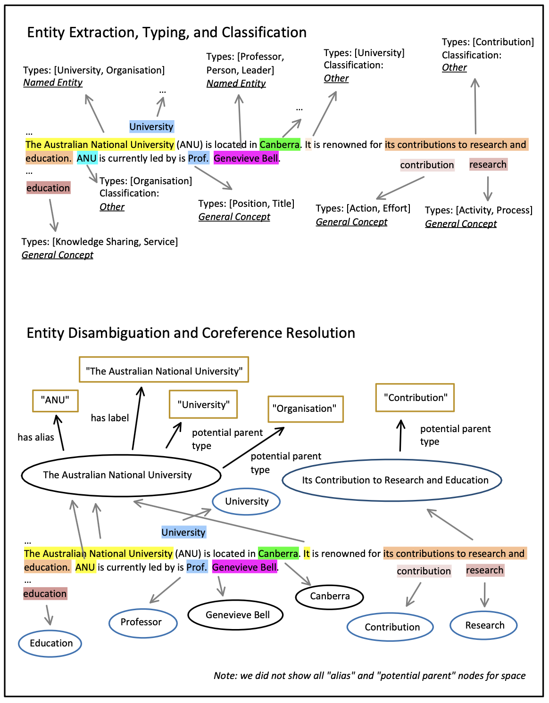
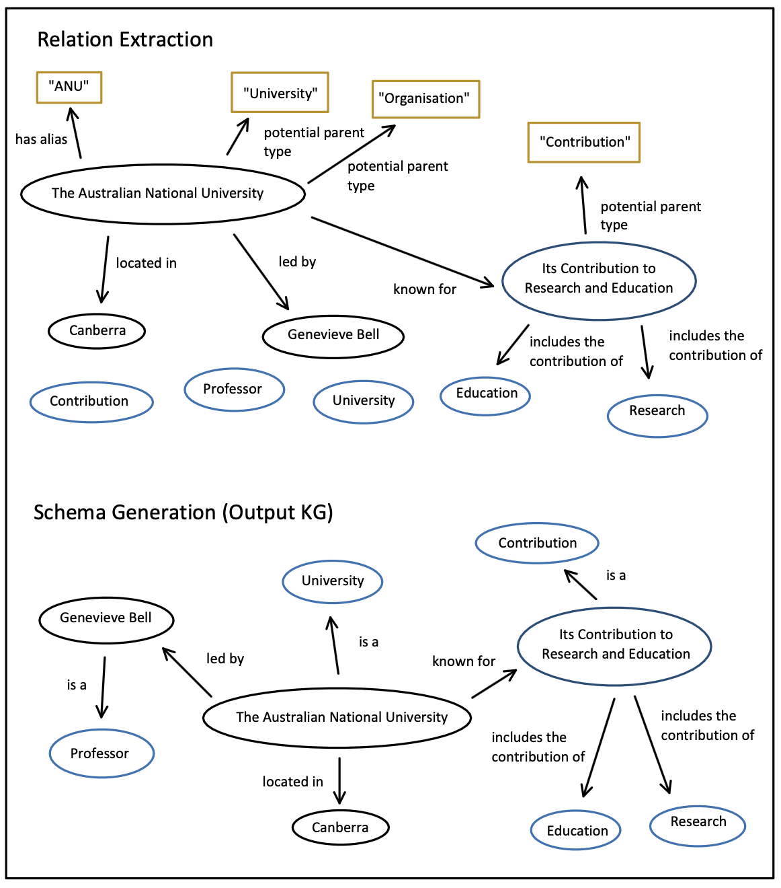
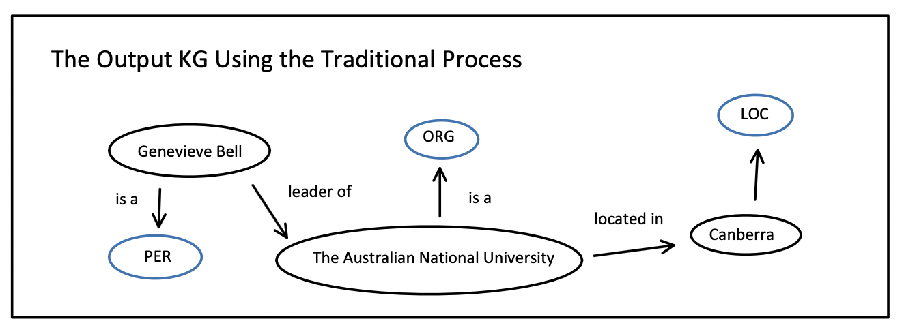

# Design of the Local Open KGC Approach

## Demonstration of the Local Open KGC Approach

Our local open KGC approach aims to construct a local knowledge graph (KG) from text documents that capture *any relationship* between entities of *any type*. Entities include anything that can syntactically appear in the original text, whether a Named Entity, such as "ANU," or a concept, such as "University." The mention can be explicit, like "Amy," or implicit, like "It."

Our proposed open KGC process consists of the following steps:

1. Entity Extraction, Typing, and Classification (Figure 1).
2. Entity Disambiguation and Coreference Resolution (Figure 1).
3. Relation Extraction (Figure 2).
4. Schema Generation (Figure 2).

Compared to the traditional approach, the key difference is that schema definition is removed and replaced by schema generation at the end. This is because we aim to build a KG without aligning it with a predefined schema. The graph in Figure 2 represents the output KG. Additionally, the output KG from the same text source using the traditional KGC process is shown in Figure 3 for comparison.


*Figure 1: Open KGC, Steps 1-2*


*Figure 2: Open KGC, Steps 3-4*


*Figure 3: The output KG from the same text source using the traditional KGC process*

### Entity Extraction, Typing, and Classification

Unlike the traditional KGC approach, which focuses on Named Entity recognition, our approach extracts all entities. However, we classify them clearly to allow filtered queries. The classification includes Named Entity, General Concept, and Other:

- **Named Entity**: Any unique, specific real-world object, such as "ANU."
- **General Concept**: A fundamental concept, such as "University," typically found in a dictionary or encyclopedia.
- **Other**: Includes entities that do not fit the above categories, such as:
  - **Non-General Concepts**: Composite concepts without a general term, e.g., "tool that maps JSON into RDF."
  - **Pronouns or Referential Expressions**: Implicit references, e.g., "Its contributions to research and education," referring to ANU's specific contributions.
  - **Undefined or Ambiguous Entities**: Terms like "It" when the reference is unclear.
  - **Entity Attributes**: Values like "1946" treated as entities rather than literals.

Figure 1 illustrates our broad entity extraction process, ensuring that every extracted mention appears exactly in the original text. Unlike some NLP approaches, we do not extract possessive terms separately but instead treat phrases like "Its Contributions to Research and Education" as a single entity.

Some KGs, such as Wikidata, may not distinguish between Named Entities and Concepts. However, for simplicity, we maintain a clear distinction since each local KG is built from a single document.

### Entity Disambiguation and Coreference Resolution

This step aligns with traditional KGC but extends to all entity types. If we successfully merge a "Named Entity" node, e.g., `ANU`, with an "Other" node, e.g., `It`, we reclassify the latter into a more specific category.

### Relation Extraction

This step differs from traditional KGC as it establishes relationships between all entity classes, not just Named Entities. We extract predicates beyond ontological relationships (e.g., `is a`, `subclass of`) and focus on relationships explicitly present in the text at both the local (sentence-level) and document-level.

### Schema Generation

Traditional KGC predefines the ontology, while our approach generates it dynamically based on extracted nodes. This step merges synonymous predicates (e.g., `head of` vs. `is the header of`) and constructs a structured ontology to enhance graph clarity.

## Comparison to Traditional KGC

Figures 2 and 3 compare the output KGs generated by our open KGC approach and traditional KGC. Key differences include:

- More nodes extracted beyond Named Entities.
- More relationships identified.
- Entities classified into more specific types rather than a predefined list.

One limitation is that relationships like `Canberra` → `Location` are missing in our KG because we only capture information *explicitly* mentioned in the text. For instance, unless `Location` or `Capital City` appear in the text, we do not infer their connection with `Canberra`.

## Comparison to Other Non-Traditional KGC Approaches

Unlike some recent works that merge Named Entity Recognition and Relation Extraction into a single step, we retain them separately for better manageability and recoverability. Our approach also differs in:

- Extracting all entity types while maintaining structured classification.
- Deferring schema definition to schema generation at the end.
- Retaining Coreference Resolution to reduce redundant nodes.
- Considering both local and global relations instead of only local (sentence-level) ones.
- Using a lightweight, quantized LLM (LLaMA 3 7B, 4-bit) to make the approach feasible on household computers.

Our approach provides an alternative to traditional KGC, addressing its limitations while exploring new methodologies.

## SWOT Analysis for Our Open KGC Approach

### Strengths

- Extracts any entity and builds their relations as long as they syntactically appear in the document, whether explicit (e.g., `ANU`) or implicit (`It`).
- Can establish relationships across sentences (document-level extraction).

### Weaknesses

1. **Lack of Inferred Entities**: Our approach does not extract entities that are *semantically* implied but not explicitly mentioned. For example:
   
   **Text:** "Amy was practicing piano at 5:00 PM."
   
   **Ideal KG:**
   ```
   (moment_1, has time, 5:00 PM)
   (moment_1, involves subject, Amy)
   (moment_1, involves object, Piano)
   ```
   
   **Our KG:**
   ```
   (Amy, practices, Piano)
   ```
   The temporal aspect is lost unless explicitly written as "Amy has a piano practicing session starting at 5:00 PM."
   
2. **Multiple Processing Stages**: Although necessary, having separate stages (e.g., Coreference Resolution) can introduce error propagation.

### Opportunities

- Open information extraction preserves more details from the original document, allowing for richer knowledge representation.

### Threats

- Increased complexity when inferring the KG, as it may contain excessive details.
- Dependence on LLM decoders, which require more computational resources.
- Risk of hallucination, where the model may extract non-existent entities or relations.

## Conclusion

Our open KGC approach provides an alternative to traditional KGC by removing predefined schemas and extracting a wider range of entities and relationships. While it addresses several limitations of traditional KGC, it also introduces new challenges, such as error propagation and increased computational demands. Future work could explore using more expressive graph structures, such as property graphs, to capture additional nuances in knowledge representation.