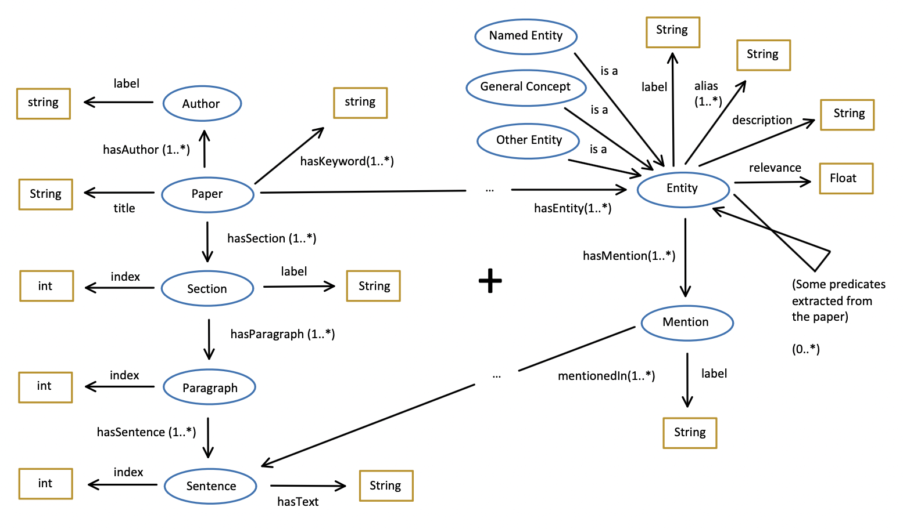
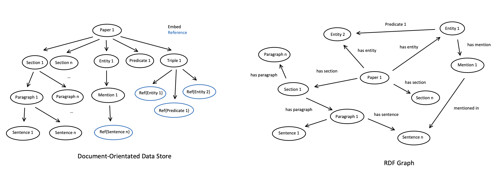
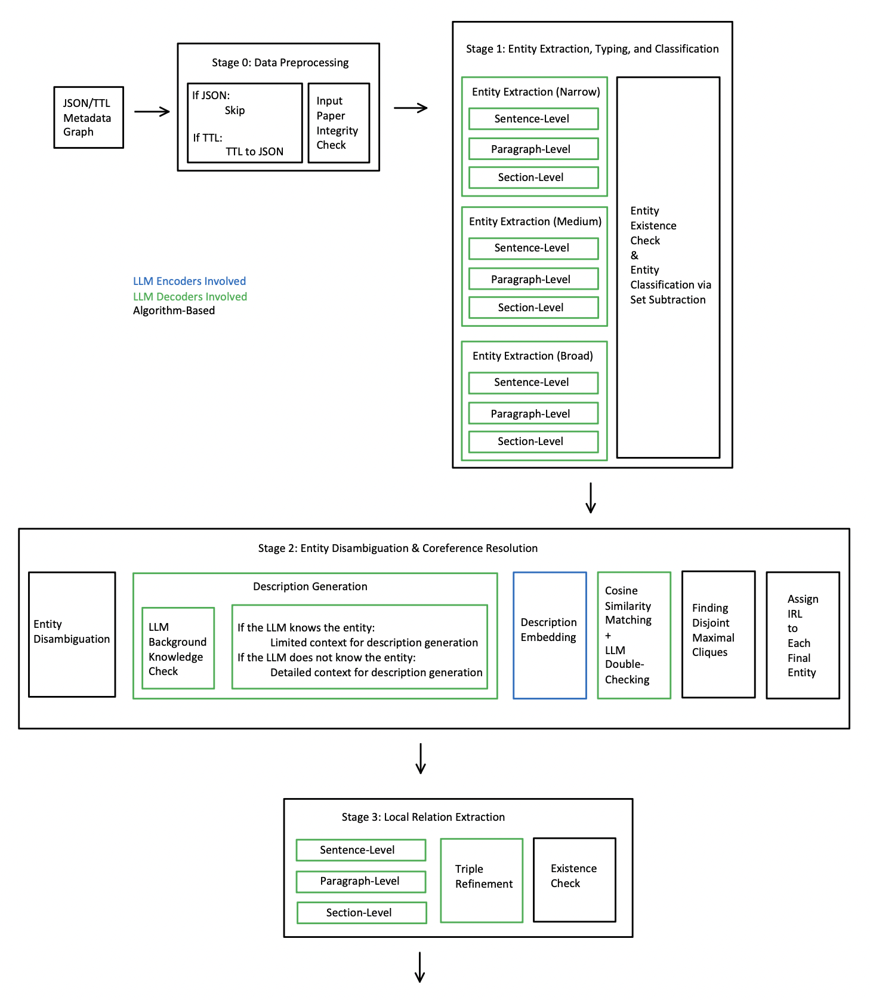
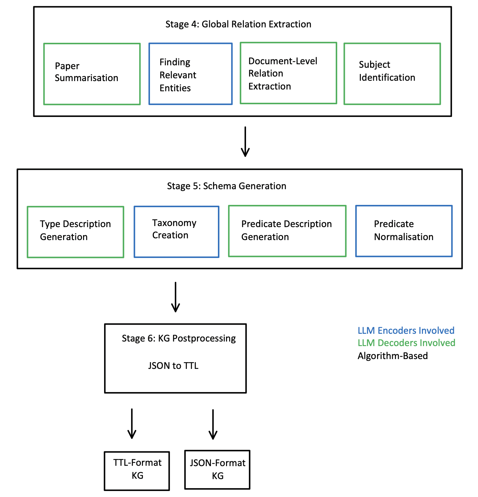
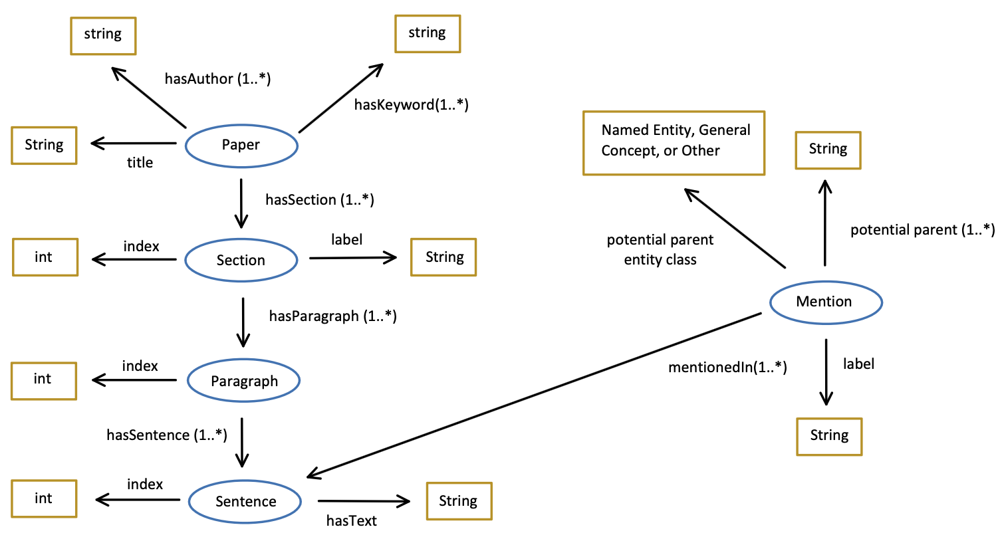
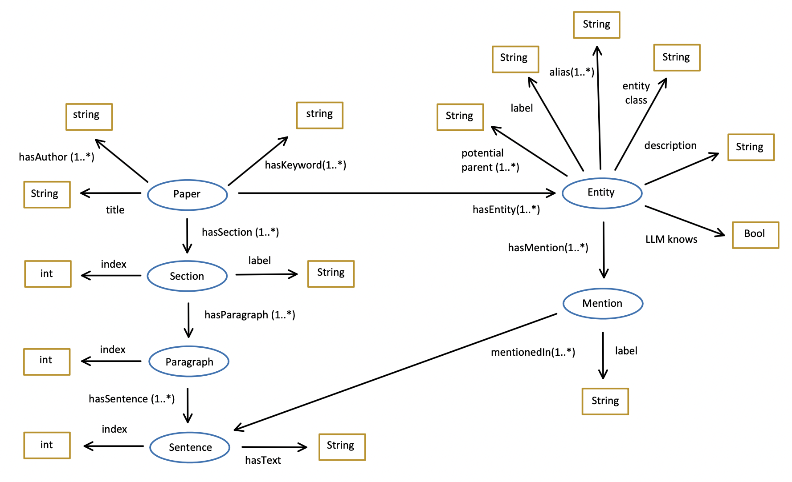
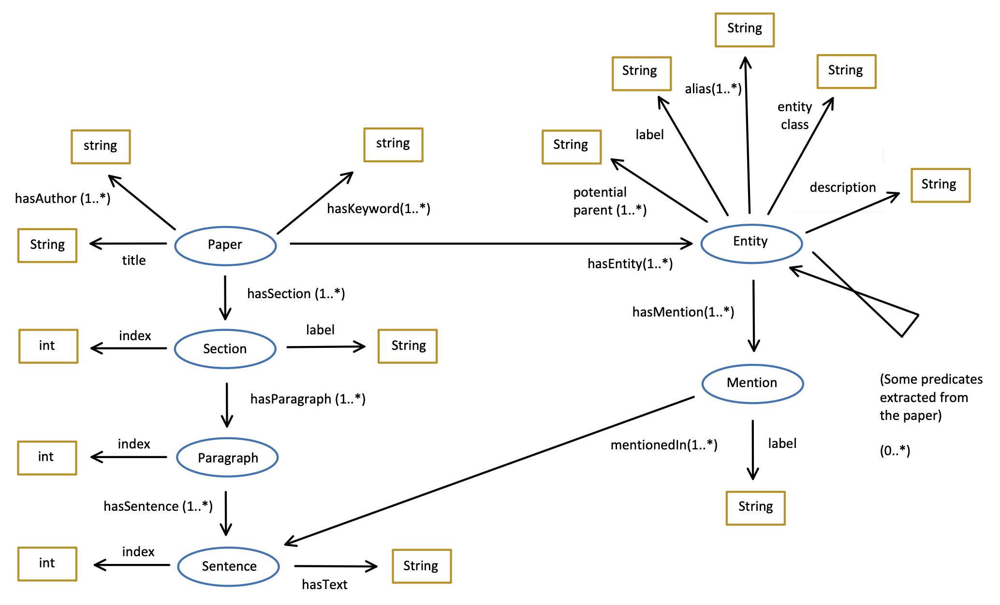
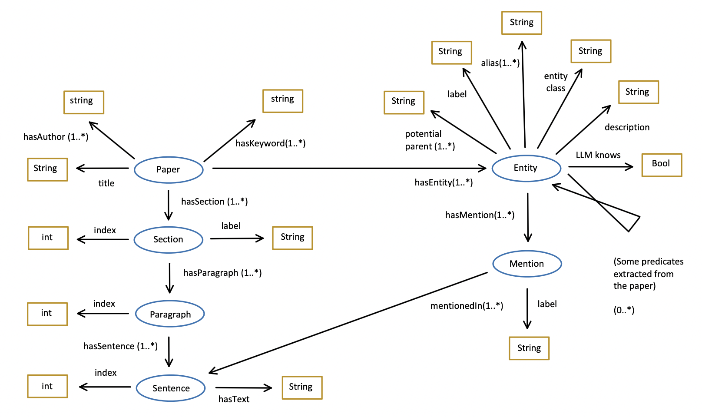
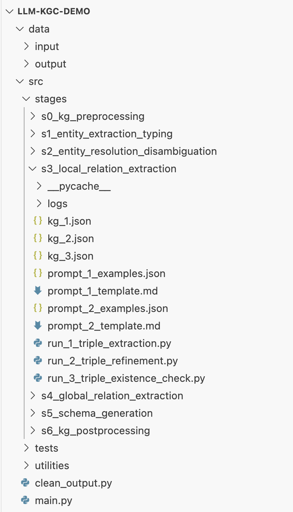
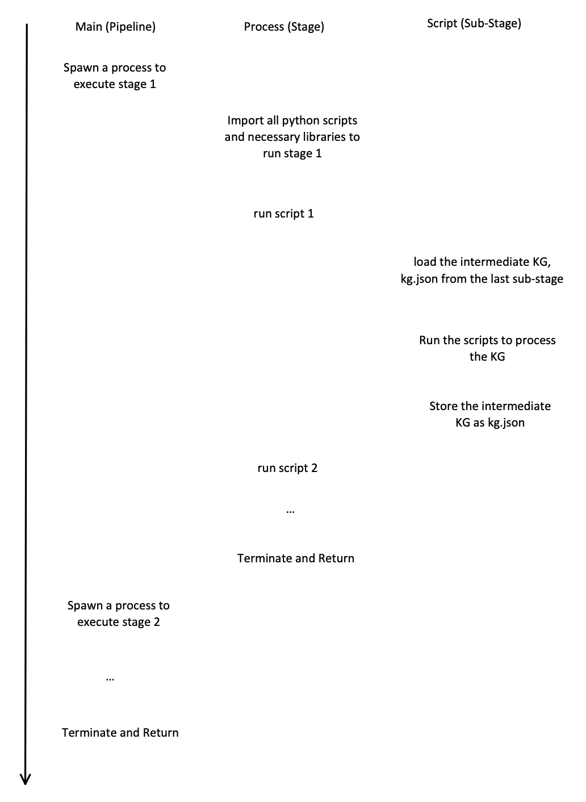

# Overview of the Implementation of the Open KGC Pipeline

The main outcome of this research is a functional KGC pipeline prototype that is capable of converting a semi-structured academic paper into its KG representation. Therefore, in this section and the following sections, we will take a close look at the pipeline and discuss the working principles behind it. Meanwhile, we will also discuss the key decisions made during the implementation of the pipeline.

## Interface

- **Input**: The semi-structured representation of an academic paper (RDF-Based Metadata Graph) in TTL or our customized JSON format.
- **Output**: The Knowledge Graph representation of the paper (RDF-Based Knowledge Graph) in TTL or our customized JSON format.
- **Language**: Python 3.12.4.
- **Software Platform**: Linux, macOS.
- **Hardware Platform**: CUDA, Metal.
- **LLM Used**: Meta-Llama-3-8B-Instruct-Q4-0, bge-english-base, bge-m3.
- **Key Packages Used**: GPT4ALL (loading LLM decoders), FlagEmbedding (loading LLM encoders), NLTK (providing basic natural language processing functionality like lemmatization).
- **Availability**: [GitLab Repository](https://gitlab.anu.edu.au/u1085404/anu-scholarly-kg/-/tree/master/llm-based/LLM-KGC-v0)

### Notes

- **GPT4ALL vs. GPT-4**: GPT4ALL and GPT-4 are distinct. GPT4ALL provides a platform to load many LLM decoders into Python. It also enables the chat completion functionality of a decoder model, meaning the model answers a user's prompt rather than simply continuing it.
- **JSON vs. TTL**: Although RDF-Graphs are commonly stored in TTL format, we use JSON to store the KG for specific reasons. Our pipeline first converts a TTL-format KG into our customized JSON-format KG and works on this format throughout the KGC stages. JSON can be loaded into Python as a dictionary, whereas TTL files require SPARQL queries, which are not natively supported by Python.

## LLM Encoders and Decoders Used

### Decoder 1
- **Name**: `Meta-Llama-3-8B-Instruct.Q4_0.gguf`
- **Size**: 4.66GB
- **Context Limit**: 8192
- **Availability**: [Hugging Face Repository](https://huggingface.co/QuantFactory/Meta-Llama-3-8B-Instruct-GGUF/tree/main)

### Encoder 1
- **Name**: `BAAI--bge-base-en-v1.5`
- **Size**: 438.9MB
- **Context Limit**: 512
- **Availability**: [Hugging Face Repository](https://huggingface.co/BAAI/bge-base-en)

### Encoder 2
- **Name**: `BAAI--bge-m3`
- **Size**: 2.29GB
- **Context Limit**: 8192
- **Availability**: [Hugging Face Repository](https://huggingface.co/BAAI/bge-m3)

Throughout this document, we will refer to these models as LLaMA, BGE, and M3, respectively.

## Development Set Used

- **Primary Development Set**: Paper titled *J2RM: An Ontology-based JSON-to-RDF Mapping Tool*.
  - **Availability**: [CEUR-WS Paper](https://ceur-ws.org/Vol-2721/paper593.pdf)
  
We selected a single academic paper as our primary development set (validation set). While limited to one paper, it consists of multiple sections, paragraphs, and sentences, offering a diverse linguistic range for evaluating different NLP edge cases. This approach accelerates development, though it may introduce biases toward specific linguistic structures.

- **Secondary Datasets**:
  - **SciERC**: Contains mappings between documents and KGs but only includes abstracts from academic papers.
  - **DocRED**: Derived from Wikipedia, featuring shortened paragraphs rather than full articles.

These datasets aid development but are limited due to their predefined entity types and predicates. SciERC, for example, only includes six academic entity types (e.g., *Task*, *Method*) and seven predicates (e.g., *Use-for*). Similarly, DocRED features six general entity types (*Person*, *Location*) and 96 predicates. Optimizing for these datasets would constrain our pipeline to traditional KG production rather than an open KG approach.

Both primary and secondary datasets will be referenced throughout later sections to illustrate key decisions made during pipeline development, especially in prompt tuning.

## High-Level Input and Output Data Structure



Figure 1 presents the high-level input and output. This representation is slightly more detailed than the one provided in the introduction and serves as a comparison point for lower-level inputs and outputs. Some intermediate fields used during processing are omitted for clarity.

## Low-Level Input (TTL and JSON)

### TTL Pseudo-Code
```ttl
paper_1_iri         is_a            Paper ;
                    has_title       "Research on the History of ANU" ;
                    has_author      "Amy", "Ben" ;
                    has_keyword     "ANU", "History";
                    has_section     section_1_iri, section_2_iri, section_3_iri .

section_2_iri       is_a            Section ;
                    has_index       2 ;
                    has_label       "Introduction" ;
                    has_paragraph   paragraph_1_iri, paragraph_2_iri, paragraph_3_iri .

paragraph_1_iri     is_a            Paragraph ;
                    has_index       1 ;
                    has_sentence    sentence_1_iri, sentence_2_iri, sentence_3_iri .

sentence_1_iri      is_a            Sentence ;
                    has_index       1 ;
                    has_text        "ANU is a university located in Canberra." .
```

### JSON Pseudo-Code
```json
{
    "iri": "paper_1_iri",
    "title": "Research on the History of ANU",
    "authors": ["Amy", "Ben"],
    "keywords": ["ANU", "History"],
    "sections": [
        {},
        {
            "iri": "section_2_iri",
            "label": "Introduction",
            "paragraphs": [
                {
                    "iri": "paragraph_1_iri",
                    "sentences": [
                        {"iri": "sentence_1_iri", "text": "ANU is a university located in Canberra."},
                        {"iri": "sentence_2_iri", "text": "It has a long history."},
                        {}
                    ]
                },
                {},
                {}
            ]
        },
        {}
    ]
}
```

## JSON vs. TTL Format

It should now be evident why JSON is preferred over TTL. RDF-Graphs inherently lack order and hierarchy—everything is stored as triples without structured relationships. Hierarchy and sequence must be inferred based on node relations and extra index nodes.

In contrast, JSON natively supports hierarchical structures, and its lists maintain order. When implemented in Python (version 3.7+), JSON's keys also retain order. This means attributes like `iri` and `title` are stored in a list rather than a set, making JSON (disk-level) and Python dictionaries (memory-level) ideal for processing structured data. 

An RDF-Graph or RDF-KG is a conceptual representation, and its storage format may vary depending on implementation needs.


## Low-Level Output (TTL and JSON)

### TTL Pseudo-Code

```ttl
/* All triples in the input are preserved plus: */

entity_1_iri            is_a                    Named_Entity ;
                        has_label               "The Australian National University" ;
                        has_alias               "ANU",
                                                "The Australian National University",
                                                "Australian National University" ;
                        has_description         "..." ;
                        has_relevance_score     0.9 ;
                        has_mention             entity_1_mention_1_iri,
                                                ... ;
                        predicate_1_iri         entity_2_iri;

entity_2_iri            is_a                    Named_Entity ;
                        has_label               "Canberra" ;
                        has_alias               "Canberra",
                                                "CBR",
                        has_description         "..." ;
                        has_relevance_score     0.8 ;
                        has_mention             entity_2_mention_1_iri,
                                                ... .
...

entity_1_mention_1_iri  is_a                    Mention ;
                        has_label               "ANU" ;
                        mentioned_in            sentence_1_iri .

entity_2_mention_1_iri  is_a                    Mention ;
                        has_label               "Canberra" ;
                        mentioned_in            sentence_1_iri .
...

predicate_1_iri         is_a                    Predicate ;
                        has_label               "located in" ;
                        has_description         "..." .
...

Named_Entity            sub_class_of            Entity .
General_Concept         sub_class_of            Entity .
Other_Entity            sub_class_of            Entity .
```

### JSON Pseudo-Code

```json
{
    "nodes": {
        "entity_1_iri": {
            "label": "The Australian National University",
            "aliases": [
                "ANU",
                "The Australian National University",
                "Australian National University"
            ],
            "node_type": "Named Entity",
            "description": "...",
            "relevance_score": 0.9,
            "mentions": {
                "entity_1_mention_1_iri": {
                    "local_name": "ANU",
                    "reference": "sentence_1_iri"
                },
                ...
            }
        },
        "entity_2_iri": {
            "label": "Canberra",
            "aliases": [
                "Canberra",
                "CBR"
            ],
            "node_type": "Named Entity",
            "description": "...",
            "relevance_score": 0.8,
            "mentions": {
                "entity_2_mention_1_iri": {
                    "local_name": "Canberra",
                    "reference": "sentence_1_iri"
                },
                ...
            }
        },
        ...
    },
    "edges": {
        "predicate_1_iri": {
            "label": "located in",
            "description": "..."
        },
        ...
    },
    "triples": [
        [
            "entity_1_iri",
            "predicate_1_iri",
            "entity_2_iri"
        ],
        ...
    ]
}
```

### Comparison Between TTL and JSON Representations

The key difference is that instead of storing everything in the KG as triples, as done in TTL, we use a hybrid approach in JSON.

- Relations that only belong to an entity, such as aliases, descriptions, and mentions, are stored directly within the entity's local fields rather than in a global `triples` field.
- Relations between two entities are stored in the global fields similarly to TTL. This way, the JSON-based KG consists of a list of nodes, a list of edges, and a list of triples.

This structure allows us to easily observe local entity relations, such as labels and aliases, by checking the entity itself, while global relations between entities are maintained in a single `triples` list. This makes it easier to analyze and debug relationships in the raw JSON file without needing a KG visualization tool.

In contrast, TTL scatters relations across entities, making it difficult to track specific relationships without visualization tools. TTL does not guarantee that the triple (`entity_1_iri`, `predicate_1_iri`, `entity_2_iri`) is stored directly under `entity_1_iri`; it can appear anywhere in the file, making ordering and hierarchy unclear.

Our pipeline converts the intermediate JSON-based KG back to TTL as the output format, as TTL remains the most widely supported format for KGs.

### Different Views of Input and Output

#### Figure: Original Input and Modified Input



#### Table: Comparison of Input and Output

| Semantic Structure | Semi-Structured Paper | Intermediate KG | KG of the Paper |
|--------------------|----------------------|-----------------|---------------|
| Logical Structure | RDF-Graph | Document-Oriented Data Store | RDF-Graph |
| Disk Storage | TTL | JSON | TTL |
| Memory Representation | RDF Graph Object | Python Dictionary | RDF Graph Object |

## Pipeline Structure

Figures below illustrate the overall pipeline structure. Green boxes indicate LLM decoders, blue boxes indicate LLM encoders, and black boxes represent purely algorithmic stages. Parallel boxes indicate independent stages that can run concurrently.

### Figure: Pipeline Structure (Stage 0 - Stage 3)



### Figure: Pipeline Structure (Stage 3 - Stage 6)



### Stage 0: Data Pre-Processing

This stage converts TTL-based KG into our customized JSON format so that when loaded into memory, it becomes a Python dictionary for further processing. Our pipeline primarily takes semi-structured papers from ASKG as input, which are usually in TTL format.

Another key step is an integrity and consistency check to ensure later algorithms do not fail. RDF Graphs are highly flexible, often lacking explicit constraints like those in relational models. For example, there is no built-in guarantee that a paper node has at least one section, even if such constraints exist in the ontology graph.

During initial data ingestion, we found integrity issues such as duplicate titles or missing sections in papers. To handle this, our preprocessing step verifies:

- A paper has **exactly** one title.
- A paper has **at least** one author, keyword, and section.
- A section has **exactly** one subtitle.
- A section has **at least** one paragraph.
- A paragraph has **at least** one sentence.
- A sentence has **at least** one text segment.

This ensures the input is structured correctly before further processing.


## Stage 1: Entity Extraction, Typing, and Classification

As shown in Figure 1, this stage involves extracting all entity mentions in the text, assigning them one or more potential parent types, and classifying them as either Named Entity, General Concept, or Other.

The extraction process is divided into three sub-stages: narrow, medium, and broad. This classification approach is useful when performing entity classification via set subtraction. The narrow entity extraction extracts only named entities in the document. The medium entity extraction retrieves both named entities and general concepts. The broad entity extraction extracts all entities. By using set subtraction, we classify extracted entities into Named Entity, General Concept, and Other.

The extraction process proceeds from the sentence level (looping through every sentence) to the section level (looping through every section), i.e., fetching the LLM sentence by sentence or section by section to extract entities.

After extraction, our pipeline checks if each entity is present in the document. The reasons for these steps will be discussed in Section 2.

After Stage 1, all Mention nodes are created in our knowledge graph (KG). Figure 2 shows the intermediate KG ontology after this stage. Note that entity nodes are not created until Stage 2. We use the term "type" to refer to an entity's parent category. For example, "ANU" has the type "University." The term "class" refers to the broad classification of an entity, e.g., "ANU" has the class "Named Entity."


*Figure 1: Intermediate KG Ontology after Stage 1*

## Stage 2: Entity Disambiguation and Coreference Resolution

This stage, as shown in Figure 3, involves linking all mentions referring to the same entity into Entity nodes. The ontology of the intermediate KG after this stage is shown in Figure 4.


*Figure 2: Intermediate KG Ontology after Stage 2*

At the beginning of this stage, we assume all mentions refer to distinct entities. Therefore, an Entity node is created for each Mention.

We first perform Entity Disambiguation to merge entities with the same label (name).

Next, we prompt the LLM decoder to generate a description for each entity. The description quality depends on whether the LLM has background knowledge of the entity.

Then, we use the description, entity label, and entity types to generate an embedding for each entity using the LLM encoder.

If two embeddings are found to be similar, we prompt the LLM decoder to double-check. If two entities are deemed similar, we draw a temporary edge between them.

Entities are merged into a single entity only if they form a complete graph (clique) in our intermediate KG.

When merging two entities, the new entity's mentions become the union of the mentions from both original entities. The label (representative name) of the entity is chosen based on the first appearance in the document. Other names are stored as aliases. This follows the assumption that in academic writing, the first appearance of an entity is usually its full name (e.g., "The Australian National University" rather than "ANU").

If an Other Entity is merged with a Named Entity or a General Concept, the resulting entity takes the more specific classification. If a General Concept is merged with a Named Entity, the result is a Named Entity.

After this stage, all Entity nodes in our KG are created and assigned a fixed IRI. The only missing component is the edges between entities.

## Stage 3: Local Relation Extraction

This stage, as shown in Figure 5, involves extracting relations between entities within a limited context. For example, given entities in a sentence, paragraph, or section, we extract relations in the form of "(Subject, Predicate, Object)" by prompting the LLM decoder.

During development, we observed that our lightweight LLaMA3 sometimes groups predicates and objects together, leaving the object slot blank. To address this, we implemented an extra triple refinement or decomposition step to correct such triples. Additionally, we check whether both the subject and object exist in the document to prevent hallucination issues, as discussed in Section 3.


*Figure 3: Intermediate KG Ontology after Stage 3*

## Stage 4: Global Relation Extraction

This stage, as shown in Figure 6, begins by summarizing the original document to fit within the LLM decoder's context limit. Summarization starts from the middle sections and proceeds toward the abstract and conclusion to minimize information loss.

Then, we calculate the relevancy score for each entity by comparing its embedding with the document embedding.

Only the top 10% or up to 20 of the most relevant entities are selected for global relation extraction, as this process involves complex pairwise comparisons (O(n^2)). For each entity pair, we extract a predicate by prompting the LLM decoder with the shortened document.

During development, we found that our LLM struggles to determine subjects and objects correctly. To address this, we implemented an additional step where the LLM is prompted to determine the subject of an extracted relation.


*Figure 4: Intermediate KG Ontology after Stage 4*

## Stage 5: Schema Generation

This stage consists of two parts: Taxonomy Generation and Predicate Normalization.

Taxonomy Generation establishes parent-child relationships between entities not extracted in previous stages. For instance, "ANU" is linked to "Public University," which is further linked to "University."

This step utilizes potential parents generated in Stage 1. Descriptions and embeddings are generated for potential parents, which are then compared against other entity embeddings. If a match is found, the entity is assigned as a child of the matched entity, forming a hierarchical structure.

Predicate Normalization merges similar predicates. Descriptions and embeddings are generated for each predicate, and predicates are merged based on embedding similarity. The KG's ontology remains unchanged after this step, maintaining the structure shown in Figure 4.

## Stage 6: KG Post-Processing

This stage converts our custom JSON-format KG into TTL-format KG and removes intermediate fields such as paper summaries and potential parents. However, this is optional and depends on deployment requirements. The ontology remains the same as in Figure 4.

## Execution Diagram

The Python project structure of the pipeline is shown in Figure 7. The pipeline consists of a master program (`main.py`) and several stage packages, each containing multiple scripts.


*Figure 5: Python Project Structure*

The execution diagram (Figure 8) illustrates the pipeline workflow. Since different stages have different dependencies, the master program spawns a new process before running each stage to avoid excessive memory usage. Each script reads the previous script’s output (`kg_x.json`), processes it, and writes a new `kg_x.json`. This approach preserves intermediate results, providing recovery points in case of failure. The downside is slightly higher memory consumption, but this is negligible compared to LLM execution time.


*Figure 6: Execution Diagram of the Pipeline*

## Decision Making and Analysis

### Single Paper as the Primary Development Set

**Pros:**
- Speeds up development.
- Covers diverse linguistic patterns compared to using only a few sentences or paragraphs.
- Uses a full paper, unlike some datasets that only use abstracts.

**Cons:**
- Potential bias toward a single paper.
- Limited ability to discover edge cases.
- No labeled ground-truth KG for reference.
- Existing labeled datasets do not support open information extraction.

### Modular Design

We maintain a modular pipeline and store intermediate KG data on disk for efficiency, upgradability, and fault tolerance. The trade-off is additional disk space usage.

### Using JSON Instead of TTL

We use JSON instead of TTL as an intermediate format due to its Python compatibility, structured representation, and readability. The downside is the extra conversion step to TTL in the final stage.