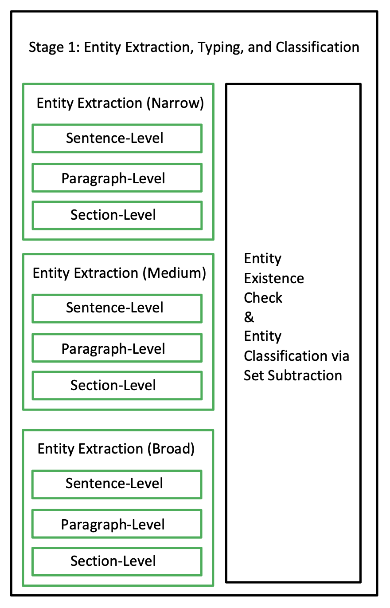
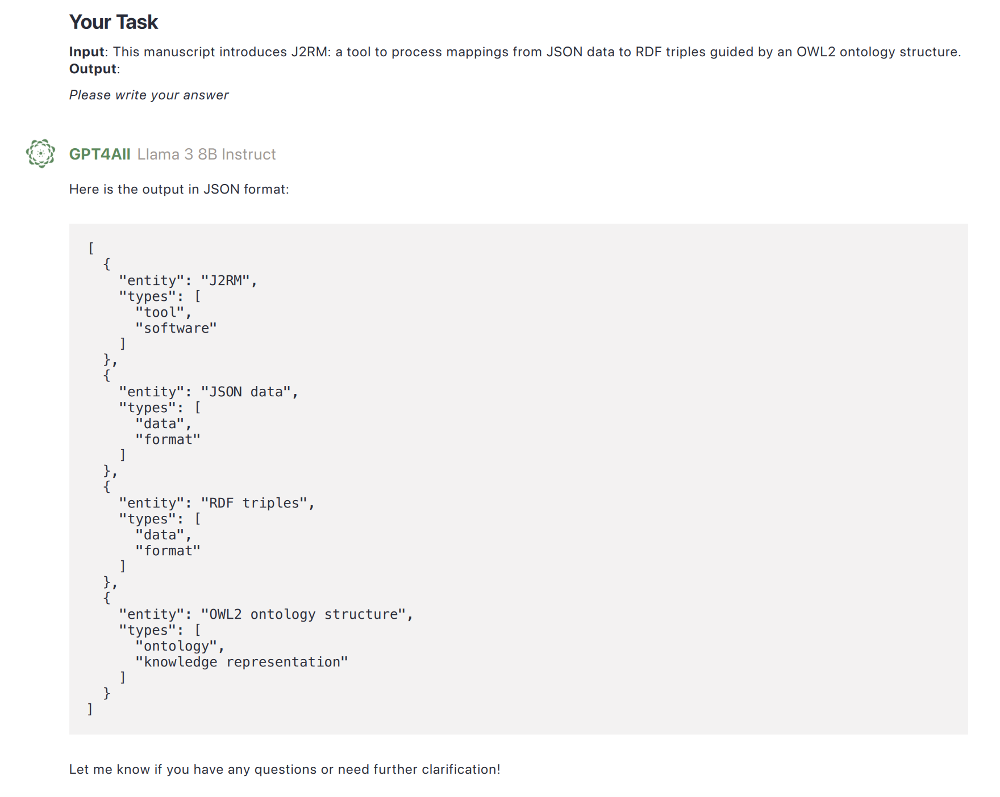
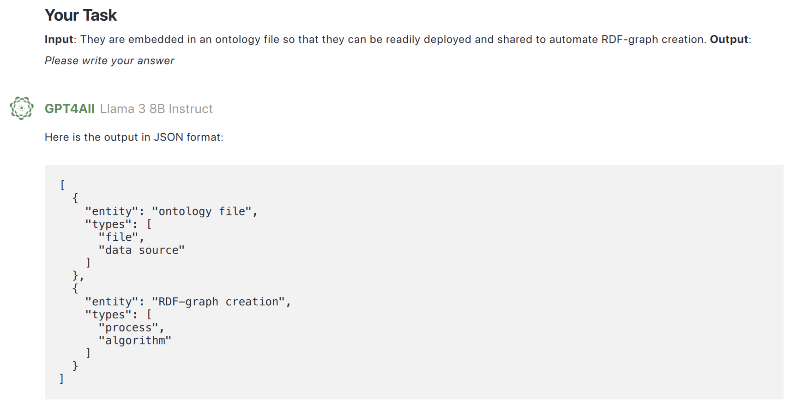
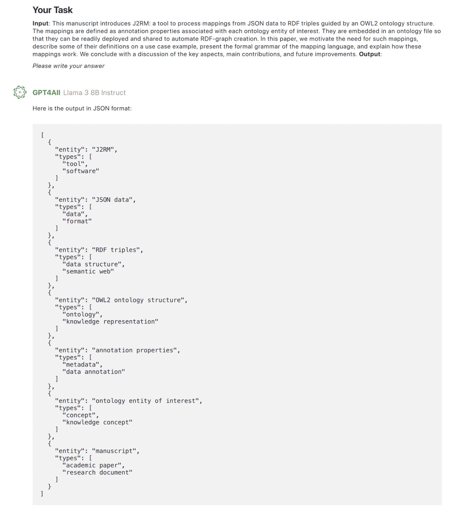

# Stage I: Entity Mention Extraction, Classification, and Typing

The chapter covers the implementation details of Stage 1 of the pipeline: Entity Mention Recognition, Classification, and Typing. Specifically, it details the algorithm, complexity, and key decisions made during development.

## Algorithm



**Figure 1:** Entity Mention Extraction, Typing, and Classification (High-Level)


**Figure 2:** The input and output of Stage 1

As shown in Figure 1, Stage 1 of the pipeline processes the paper document iteratively, going sentence by sentence, paragraph by paragraph, and section by section. In each iteration, a single sentence, paragraph, or section is sent to an LLM, extracting entity mentions along with their potential parent types. This process is repeated three times with slightly different prompts, ensuring the LLM focuses on the following perspectives:

1. "Named Entity Only"
2. "Named Entity plus General Concept"
3. "All Potential Entities"

This strategy minimizes entity misses and allows the pipeline to classify entities into named entities, general concepts, or others through set subtraction. While this classification might not seem intuitive at this stage, it is crucial for the assumptions made in Stage 3: Coreference Resolution and Entity Disambiguation. Without this classification, those assumptions would fail.

Finally, the pipeline verifies whether each entity mention actually appears in the original document, avoiding LLM-generated hallucinations. Figure 2 shows the input and output of this stage, where input components are in gray and output components in color.

The detailed algorithm is as follows:

```plaintext
Input: A semi-structured paper
Output: An intermediate knowledge graph (KG) with added Mention nodes

# Extraction and Typing
For extraction_option in [Named Entity, Named Entity + General Concept, Entity]:
    For each section in the paper:
        For each paragraph in the section:
            For each sentence in the paragraph:
                * If extracting Named Entities, inject a dummy Named Entity 
                  into the sentence before prompting the LLM to prevent hallucinations.
                
                [LLaMA Prompt_1] Ask the LLM to extract all mentions referring 
                to {extraction_option} in the {sentence} and their potential parent types.
                
                Store them in the set {extraction_option} under the specific {sentence}.
            
            [LLaMA Prompt_1] Similarly, extract mentions at the paragraph level.
        
        [LLaMA Prompt_1] Similarly, extract mentions at the section level.

# Classification
For each section in the paper:
    For each paragraph in the section:
        For each sentence in the paragraph:
            Named Entity set = original Named Entity set
            General Concept set = (Named Entity + General Concept set) - Named Entity set
            Other set = (Entity set) - General Concept set

# Existence Check and Reference Fixing
DEFAULT_NORMALIZATION = lemmatization using NLTK

def is_existing(mention, sentence):
    return whether the normalized mention appears in the normalized sentence.

For each section in the paper:
    For each paragraph in the section:
        For each sentence in the paragraph:
            For each mention in {Named Entity, General Concept, Other}:
                If not is_existing(mention, sentence):
                    Discard it.

        For each mention in {Named Entity, General Concept, Other}:
            For each sentence in the paragraph:
                If is_existing(mention, sentence):
                    Copy and add the mention to the specific sentence's set.
        
        Delete all mentions under the paragraph.
    
    For each mention in {Named Entity, General Concept, Other}:
        For each paragraph in the section:
            For each sentence in the paragraph:
                If is_existing(mention, sentence):
                    Copy and add the mention to the specific sentence's set.
    
    Delete all mentions under the section.

# Moving all mentions from sentence level to paper level
For each section in the paper:
    For each paragraph in the section:
        For each sentence in the paragraph:
            For each mention in {Named Entity, General Concept, Other}:
                Move the mention to paper["Mentions"]
                Maintain a link between the mention and its original sentence.
                Also, store the potential class of the entity.
```

### Key Decision: Preventing Hallucinations

A key decision in the algorithm was injecting a dummy Named Entity into the sentence before Named Entity Mention Extraction. This was necessary because the LLaMA model suffered from severe hallucination issues. When a sentence contained no Named Entities, the model often generated incorrect entities. For example, in a sentence like _"Cats eat fish"_, the model would attempt to extract entities that were not actually present. Since the LLM tends to avoid returning empty results, appending a phrase like _"This sentence is presented by {an extremely rare person's name}"_ mitigated the issue.

## Prompts

The way we instruct the LLM decoder to extract mentions for "Named Entity", "Named Entity + General Concept", and "Entity" does not directly use these terms in the prompt.

While knowledge graphs (KGs) can include almost anything with an identity, in practice, the term "Entity" commonly refers only to "Named Entity + General Concept". When asking the LLaMA model to extract "Entities", it only identifies Named Entities and General Concepts. This behavior was confirmed through multiple trial-and-error tests during development.

Furthermore, requesting the LLM to extract all "Mentions" effectively retrieves all "Entities" as per our definition. The mapping between the extraction keywords and the actual entity classes is as follows:

- Extracting Mentions to Named Entities → Extracting "Named Entities"
- Extracting Mentions to Named Entities and General Concepts → Extracting "Entities"
- Extracting Mentions to All Entities → Extracting "Mentions"

### Prompt Template

The actual prompt template used in the pipeline is structured as follows:

```plaintext
[Instruction to LLM]
Extract all mentions referring to {extraction_option} in the given text.
For each mention, provide its potential parent types.
Ensure that extracted mentions appear in the original text and do not hallucinate new entities.


# Prompt 1: Entity Extraction

## Task Definition

You are a linguistic expert involved in a {named entity recognition/entity extraction/mention extraction} task for academic papers. Given a text in a paper, your task is to identify and extract all {named entities/entities/mentions} and assign them one or more types.

## Output Format

Please write your answer in JSON format, consisting of zero or more entity-type pairs, as shown below:

```json
{format_example}
```

## Examples

**Input**: {input_example_1}  
**Output**:

```json
{output_example_1}
```

**Input**: {input_example_2}  
**Output**:

```json
{output_example_2}
```

**Input**: {input_example_3}  
**Output**:

```json
{output_example_3}
```

## Your Task

**Input**: {text}  
**Output**:

*Please write your answer*

---

# Assumptions Made

Several key assumptions were made during the development of this stage. Some of them also apply to later stages.

## A1: LLMs are Knowledgeable

We assume that the LLM used is familiar with common terminologies in NLP and linguistics. Therefore, our prompt omits explicit definitions, such as what a named entity is, to keep it concise and reduce complexity. This assumption applies to all stages in the pipeline.

## A2: All Sections Fit the Context Limit of the LLM Used

We assume that the input paper has been preprocessed so that all its sections fit within the context limit of the LLM used in the pipeline. Additionally, we assume that each section, along with the abstract (the first section), also fits within the context limit. If a section exceeds this limit, the pipeline will abort while preserving its intermediate knowledge graph for recovery. This assumption applies to all stages in the pipeline.

## A3: Identical Mentions in a Local Text Refer to the Same Thing

In our prompt, we ask the LLM to extract mentions from a given local text (a sentence, paragraph, or section) and output a list of found mentions without tracking their specific locations. Therefore, we assume that all mentions with the same name within a single sentence refer to the same entity. For example, in the sentence:

> "An apple is the fruit of the apple tree."

Both mentions of "apple" refer to the same concept.

However, this assumption may not hold in rare cases. Consider the sentence:

> "Apple is a technology company whose logo is a bitten apple."

If "Apple" is extracted as a mention, our pipeline cannot distinguish whether it refers to the company or the fruit. Nevertheless, academic writing rarely contains such ambiguous terms. If a sentence contains two similar mentions that refer to different entities, such as:

> "(Wang et al., 2024a)" and "(Wang et al., 2024b),"

we assume the authors have provided sufficient disambiguation.

A possible way to mitigate this issue is to ask the LLM to output the position of each mention (e.g., token or character index) or annotate the original text. However, this approach is complex due to the stochastic nature of LLM outputs, as they predict the next token probabilistically. Additionally, annotating nested or overlapping entities can be challenging. To keep things simple, we maintain this assumption in our pipeline.

For identical mentions in different sentences, our pipeline tracks their locations, so they can refer to different things.

## A4: Entity Mentions Extracted at the Paragraph or Section Level Apply to All Relevant Sentences

If an entity mention is extracted at the paragraph or section level, all sentences containing the term receive the mention, regardless of whether it was extracted at the sentence level. For example, if "ANU" is extracted at the paragraph level, all sentences containing "ANU" will also have the entity mention.

Another example is the mention "It." If "It" is extracted at the paragraph or section level and appears multiple times, it is assigned to all sentences containing "It." Since the paragraph or section-level extraction is ambiguous, we distribute the mention across all relevant sentences. Before coreference resolution, we treat these mentions separately and assume they refer to different things.

## A5: Extracted Named Entities and Concepts Are Correct

We assume that when we ask the LLM to extract named entities, it only returns named entities. Similarly, when we ask for named entities and general concepts, it provides only those. This assumption is crucial because our classification approach relies on the correctness of the extraction process.

---

# Limitations

There are two major limitations at this stage.

## L1: Only Syntactically Present Mentions Are Extracted

During development, we observed that LLM outputs can be stochastic even with a low-temperature setting. For instance, given the sentence:

> "There are 5 people."

The LLM might output "Five" instead of "5." If our normalization tool is not sophisticated enough to recognize both as equivalent, "Five" may be rejected, leading to missing entities. However, we still check whether an extracted mention appears syntactically in the original text, as LLMs can sometimes hallucinate mentions.

A proposed solution by previous studies is to prompt the LLM again to verify whether an extracted mention exists in the original sentence. However, this approach is computationally expensive and unreliable, as the verification itself can be hallucinated. Instead, we use a traditional rule-based method to minimize hallucinations, leading to this limitation.

## L2: Only Entities with Explicit Mentions Are Captured

Our knowledge graph construction (KGC) approach extracts mentions and constructs entities from them. However, some entities may not have an explicit form in the text. For example, in the sentence:

> "Amy was practicing piano at 5 PM."

The concept of "moment" is implied but not explicitly mentioned. This limitation arises from our pipeline's design and carries through the implementation.

---

# Complexity Analysis

This section outlines the general complexity analysis for all stages of the pipeline and derives the complexity of Stage 1.

## Analysis Approach

Since an LLM decoder call is computationally expensive, our complexity analysis focuses only on the number of times the decoder is called. Other computations, such as file I/O or regular processing, are modeled as $O(n)$. Thus, the complexity of Stage 0 (Input Preprocessing) and Stage 6 (KG Post-Processing) is $O(n)$.

Although a single LLM decoder call has a more-than-quadratic complexity concerning the number of tokens in a prompt, we assume that prompt lengths are bounded and similar across executions. Therefore, we treat each LLM decoder call as $O(1)$ for simplicity. This assumption applies throughout the implementation.

## Stage 1 Complexity

The algorithm loops through the paper at three hierarchical levels: sentence, paragraph, and section. The number of LLM decoder calls is approximately proportional to the length of the paper $L$. Since the document is processed three times (once per level), the complexity is:

$$ O(9L) $$

This complexity will be validated by runtime measurements on papers of different lengths.

# Decisions Made and Analysis

The following sections discuss key decisions made and the reasoning behind them.

## Simple Prompts vs. Detailed Prompts

We aim to keep prompts as simple and concise as possible throughout all stages of the pipeline. This is because the complexity of large language models (LLMs) increases more than quadratically with the number of tokens in a prompt. During development, we tested both short and long versions of prompts. However, we found that an LLM could respond to a short prompt in about a second, whereas a long prompt could take up to 30 seconds, significantly affecting runtime performance since our pipeline makes frequent LLM calls.

Additionally, different individuals, including AI models, may interpret terminology differently. For example, defining "named entity" explicitly in a prompt might contradict the internal knowledge of the LLM, causing confusion. Therefore, we chose to trust the LLM’s internal knowledge rather than enforce definitions. The downside of this approach is that it assumes the LLM is sufficiently knowledgeable.

This decision applies throughout the pipeline. Although some studies suggest that adding part-of-speech (POS) tagging can assist in entity extraction by incorporating syntactic reasoning, our tests showed minimal impact. The added complexity only increased runtime significantly. Therefore, we decided to rely on simple prompts and let the LLM handle the task without POS tagging.

Other research suggests that example selection should be relevant to the input text. For instance, extracting entities from the sentence, *"ANU is a university located in Canberra."* would ideally use examples from a semantically relevant knowledge base. However, existing datasets often limit entity types, which can mislead the LLM when performing open entity extraction. Instead, we opted to provide three general, hand-crafted examples. This ensures that the LLM understands the task without imposing strict rules on what should be extracted.

## Hierarchical Extraction

Our pipeline performs entity extraction hierarchically along two dimensions: entity scope and text structure.

Extracting entities at the sentence, paragraph, and section levels provides both a narrow and broad view of the text, reducing the chance of missing relevant entities.

Figures below compare sentence-level and paragraph-level entity extraction for the same text from our development set. Figures 1 and 2 correspond to sentences from the paragraph shown in Figure 3.


*Figure 1: Sentence-Level Entity Extraction*


*Figure 2: Sentence-Level Entity Extraction (Second Example)*


*Figure 3: Paragraph-Level Entity Extraction*

In Figure 1, most entities were extracted except for *"manuscript."* However, the paragraph-level extraction in Figure 3 captured *"manuscript."* 

Conversely, some entities, such as *"RDF-Graph creation,"* were missed in paragraph-level extraction but successfully identified in sentence-level extraction (Figure 2). 

This demonstrates how hierarchical extraction complements itself. The primary reason for using different levels of entity extraction is to facilitate classification via set subtraction.

## Explicit Entity Classification vs. Classification via Set Subtraction

During development, we found that asking the LLM to classify entities explicitly into "Named Entity," "General Concept," and "Other" was ineffective. Unlike LLM encoders, LLM decoders struggle with classification tasks, as noted in recent research. Thus, we opted for classification via set subtraction.

We attempted two explicit classification approaches:

1. **Classifying entities at extraction time:** We instructed the LLM to extract either named entities, general concepts, or other entities separately. However, the stricter and more specific the instruction, the worse the LLM’s performance became. Hallucination issues increased, requiring us to inject dummy entities to mitigate errors.
2. **Post-extraction classification:** After extracting all entities, we prompted the LLM to classify them into categories. This approach also failed due to frequent misclassifications.

Ultimately, we chose a gradual expansion method—starting with a narrow scope and incrementally broadening it. This method not only provides a basic classification via set subtraction but also mitigates the classification limitations of LLM decoders.

## JSON Output vs. Custom Format Output

Since LLM decoders generate plain text responses, parsing them into structured data is necessary for further processing. Initially, we designed a custom format using special delimiters (e.g., `[` and `]`) to structure the output for parsing. However, edge cases frequently caused parsing failures.

We later discovered that LLM decoders perform well with JSON output. Additionally, built-in JSON parsers in programming languages like Python handle escaping and edge cases automatically. Consequently, we standardized JSON as the output format for all LLM calls.

Furthermore, we chose Markdown syntax for writing prompts because the LLaMA model we used interprets Markdown effectively. Studies also suggest that structured syntax improves LLM understanding compared to plain text prompts.

---

This document outlines key decisions made in optimizing prompt design, extraction hierarchy, classification methodology, and output format in our open entity extraction pipeline.