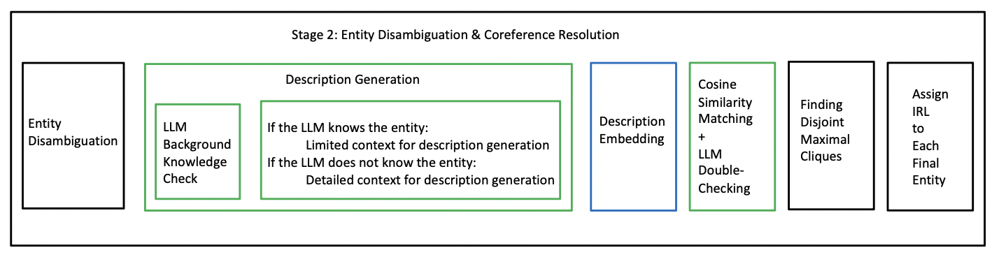
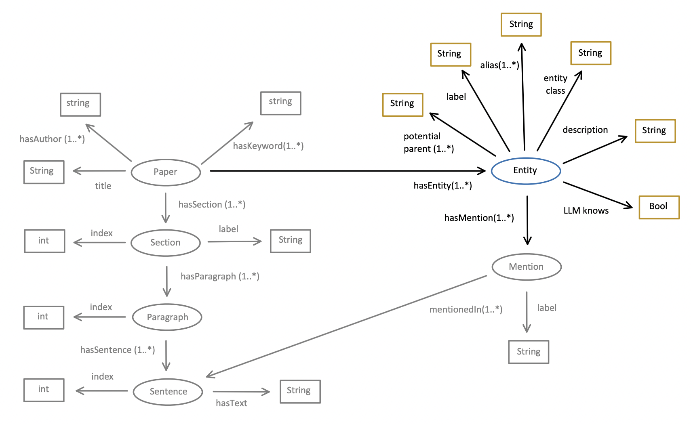

# Stage II: Entity Disambiguation and Coreference Resolution

This chapter covers the implementation details of Stage 2: Entity Disambiguation and Coreference Resolution, discussing the algorithm, complexity, and key decisions made.

## Algorithm



*Figure 1: Entity Disambiguation and Coreference Resolution (High-Level)*

As shown in Figure 1, the algorithm begins by creating an entity node in the intermediate knowledge graph (KG) for all mentions. Initially, it conservatively treats all mentions as distinct entities. For example, "Python" in sentence 1 is considered different from "Python" in sentence 14. At this stage, each entity has only one mention, with its label identical to the mention's label.

### Entity Disambiguation

The next step is entity disambiguation, where entities with the same name are carefully merged. This is based on the assumption that named entities and general concepts in academic writing are unambiguous. For instance, all occurrences of "Python" in an academic context refer to either a type of snake or a programming language, and all mentions of "Wang" refer to the same person. The assumption is that authors handle potential ambiguity by using clarifications such as brackets.

Thus, named entities and general concepts with identical names are safely merged, combining their mention sets. The entity label is chosen based on the first mention in the paper, under the assumption that academic writing introduces full terms before using abbreviations. The full name becomes the primary label, and other names serve as aliases.

While named entities and general concepts are merged, other entities remain untouched. For example, a mention like "It" cannot be merged without coreference resolution since it might refer to different things in different sentences. If a named entity is merged with a concept, it is treated as a named entity.

### Coreference Resolution

After merging entities with the same name, the algorithm attempts to merge entities with different names that refer to the same concept. This is done through coreference resolution, commonly performed using large language models (LLMs). As discussed in the literature review, our approach compares entity embeddings. If two entities are highly similar and verified by an LLM decoder, a temporary link is drawn between them. However, this does not guarantee that they belong to the same entity, since indirect similarity (e.g., A is similar to B, B is similar to C) does not necessarily imply that A and C should be merged.

Entities are merged only if their temporary links form a complete subgraph. The algorithm finds these maximal cliques using the Bron-Kerbosch algorithm and ensures they remain disjoint. After merging, unique IRIs are assigned to entities and mentions, enabling the intermediate KG to evolve into a valid RDF-KG.

To generate entity embeddings, labels, aliases, potential parent types, and descriptions are considered. Descriptions help distinguish entities with the same name and provide essential context, especially for new concepts introduced in the paper. 

### Generating High-Quality Descriptions

A background check is performed using an LLM to determine whether an entity is already known without additional context. This step identifies new terminologies and ambiguous entities such as "It." If the LLM recognizes an entity, only minimal context is provided for generating a general description (e.g., "University"). Otherwise, detailed context, including the paper's title, authors, abstract, and relevant sections, is supplied to ensure high-quality descriptions. For "Other" entities, detailed context is always included.

### Input and Output



*Figure 2: Input and Output of Stage 2*

The input components are shown in gray, while the output components are in color.

## Detailed Algorithm

```plaintext
Input: An intermediate KG with Mention nodes
Output: An intermediate KG with additional Entity nodes

# Entity Creation

For each mention in the KG:
    - Create an entity node with:
        - Label same as mention's label
        - Alias set containing only its label
        - Potential parent set same as mention's potential entity class
        - Entity class same as mention's potential entity class
    - Link the entity node to the original mention node
    - Delete all attributes of the original mention node except its label
    - Initialize an empty description attribute for the entity

# Entity Merging Function
def merge_entity(entity_1, entity_2):
    - Merge potential parent sets, mentions, and aliases
    - Set label as the first-mentioned entity in the paper
    - Set description from the first-mentioned entity
    - Assign entity class with precedence (Named Entity > General Concept > Other)
    - Return new merged entity and delete old entities

# Entity Disambiguation
For each entity_1 in the KG:
    For each entity_2 in the KG:
        If neither entity_1 nor entity_2 is "Other":
            If entity_1["label"] == entity_2["label"]:
                Draw a temporary link between them
Merge all connected entities using merge_entity

# LLM Background Knowledge Check
For each entity:
    - Prompt LLM with entity label only to check if it recognizes it

# Description Generation
For each entity:
    If LLM does not recognize it or entity is "Other":
        - Provide detailed context (title, authors, keywords, abstract, relevant section, sentence-level context)
    Else:
        - Provide minimal context (label, potential parent types, sentence-level context)

# Embedding Generation
For each entity:
    - Use its label, potential parent types, and description to generate an embedding

# Coreference Resolution
For each pair (entity_1, entity_2):
    If entity_1_id < entity_2_id:
        - Compute cosine similarity between embeddings
        - If similarity > 0.9:
            - Prompt LLM with entity details and context to determine if they are the same
            - If LLM confirms, create a temporary link between them

# Entity Merging
Find maximal cliques using Bron-Kerbosch algorithm:
    - Select largest clique, remove nodes from original graph, and store in disjoint_maximal_cliques
    - Repeat until no cliques larger than 1 remain
Merge all entities within each clique using merge_entity

# Assign IRIs
For each entity:
    - Assign a unique IRI based on its label for readability
    - Ensure uniqueness of IRIs for all mentions
```

This algorithm ensures effective entity disambiguation and coreference resolution, enabling a more structured and coherent intermediate knowledge graph.


# Prompts

The following are the simplified versions of the three LLM prompts mentioned in the algorithm.

## Prompt 1: LLM Knowledge Check

```plaintext
## Task

Assume that you are reading an academic paper. Given a term extracted from
the paper and its types, without seeing the context, can you tell me what
the term "{term}" refers to based only on your current knowledge?
- Answer true if you are confidently sure what it is. 
- Answer false if you do not know the term, or it is potentially
ambiguous, i.e., it may have several meanings, but its specific meaning
cannot be determined without seeing the context.

## Output Format ...
## Term ...
## Answer ...
```

## Prompt 2.1: Description Generation (Detailed)

```plaintext
## Task

You are a linguistic expert involved in a description writing task for an
entity mentioned in a paper. Given an entity's mention "{label}", its
types, the abstract of the paper (paper-level context), the specific
section where the mention appears (section-level context), and the
specific sentence of the entity mention (sentence-level context), your
task is to write a single-sentence description that can precisely tell
what the actual entity the mention "{label}" refers to.

## Output Format ...
## Input ...
## Output ...
```

## Prompt 2.2: Description Generation (General)

```plaintext
## Task

You are a linguistic expert involved in a description writing task
for an entity mentioned in a paper. Given an entity's mention "{label}",
its types, and the specific sentence of the entity mention (context), your
task is to write a single-sentence description that can precisely tell
what the actual entity the mention "{label}" refers to. 
- Your description should be as general as possible and not be specific to
the given context.
- The context is mainly used to help you understand the entity or
disambiguate the entity with others with the same name. 

## Output Format ...
## Input ...
## Output ...
```

## Prompt 3: LLM Double Check

```plaintext
## Task

You are a linguistic expert involved in the task of disambiguating
two terms in a paper. Given the abstract of the paper (paper-level
context), the term "{label_1}" and the term "{label_2}", each with its
label, types, description, and the specific section where the mention
appears (section-level context), and the specific sentence of the entity
mention (sentence-level context), your task is to determine whether these
two terms refer to **exactly** the same entity or concept. Please provide
a short explanation and then answer true or false in JSON format, e.g., ...

## Input ...
## Output ...
```

# Assumptions Made

Several assumptions are made in this stage:

- When merging entities by names, we assume that all named entities and general concepts in the paper are unambiguous. That is, named entities with the same label always refer to the same thing, which is highly likely in academic writing.
- When deciding the label of an entity, we assume that the first mention of an entity in the paper carries the most representative name.
- When using the LLM to generate a description for an unknown entity, we assume that providing the paper's title, authors, keywords, the entity's label, types, section-level context, and sentence-level context is sufficient for accurate description generation.
- When merging two entities and deciding the description of the new entity, we assume that the description of the first mention in the paper is the most representative.
- When merging two entities with conflicting classifications, we assume that classifying as a Named Entity is always more accurate than as a General Concept, which is more accurate than as an Other Entity.

# Limitations

Several limitations exist in this stage:

- We use embeddings to check if two entities are the same. However, embeddings can be lossy, meaning that two close embeddings may not always represent two closely related entities in reality.
- We generate embeddings from LLM-generated descriptions, but these descriptions themselves can be lossy.
- When checking the LLM's familiarity with an entity, the LLM may not always answer honestly. It can be overly optimistic or too conservative due to its stochastic behavior and susceptibility to hallucinations.
- When asking the LLM whether two entities are the same during the double-checking process, the LLM may again provide overly optimistic or overly conservative responses.

# Complexity Analysis

The algorithm involves looping through all entities (not fully merged) twice to check if the LLM is familiar with them and to generate a description. Thus, the complexity is $O(2M)$, where $M$ is the number of mentions. Since entity merging has not been completed at this stage, we count mentions instead of entities. Even though we can create an entity for each mention initially, the final number of entities remains uncertain.

Although embedding generation involves LLM encoders, these are generally fast and can be completed within a second. Hence, we ignore their complexity. The same applies to pairwise embedding comparisons.

However, even though we only ask the LLM decoder to double-check when two entities are found to be highly similar, in the worst-case scenario, this still results in $O(E^2)$. Therefore, the overall complexity of this stage is $O(2E + E^2)$.

# Decisions Made and Analysis

Two major decisions were made during the development of this stage:

## Using Description for Embedding Generation

During implementation, we found that an entity's description is the most valuable resource for Entity Disambiguation and Coreference Resolution. Even when two entities share the same name, such as "Apple" (a company) and "Apple" (a fruit), their descriptions differ clearly. The second most valuable resource is entity types, as these also help differentiate similar labels.

Traditionally, Entity Disambiguation and Coreference Resolution use LLM encoders that directly embed the context 
into embeddings. However, general-purpose encoders like BGE and M3 tend to embed the entire input as a whole, which may distract the LLM from focusing on the entity itself. Since our approach relies purely on in-context learning without fine-tuning, we opted to use descriptions for embedding generation. This ensures that all input to the general-purpose LLM encoder is highly relevant to the entity, resulting in accurate embeddings.

Generated descriptions are useful beyond Coreference Resolution and Entity Disambiguation. They also aid in later stages such as relation extraction. Whenever we supply an entity to the LLM, we attach its description and, sometimes, its types. This is because an entity's label (name) alone is insufficient for precise identification.

## Disjoint Maximal Cliques vs. Disjoint Connected Subgraphs

In our initial implementation, we merged any two entities that were connected in a graph. However, this led to the incorrect merging of clearly distinct entities, such as "RDF-Graph" and "J2RM" (a tool for converting JSON into RDF). This issue arises because two entities that are individually similar to a third entity do not necessarily have to be similar to each other. In the worst case, multiple entities form a chain-like structure in vector space, where the entities at either end are significantly different.

To address this, we merged entities only when they formed a clique in the related entities graph. This is similar to clustering but with strict diameter control over each cluster.
