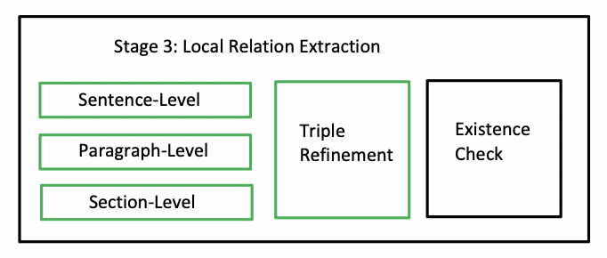
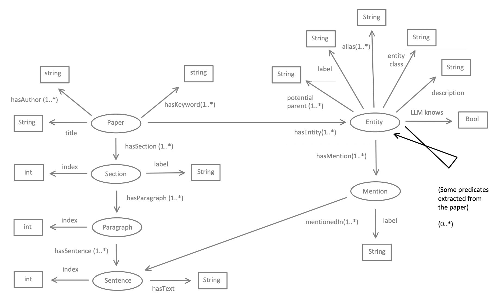

# Stage III: Local Relation Extraction

This chapter presents the implementation details of Stage 3: Local Relation Extraction, following a structure similar to previous chapters. This includes the algorithms, prompts, assumptions, limitations, complexity, and key decisions made.

## Algorithm

The approach for local relation extraction is similar to entity extraction. As shown in **Figure 1**, the algorithm processes the paper in a hierarchical manner—sentence by sentence, paragraph by paragraph, and section by section. Within each iteration, a text segment (sentence/paragraph/section) is processed along with all entities that have mentions linked to that text. The input is passed to the LLM, which outputs a list of triples. Each triple consists of a subject and an object derived from the given entities, with the predicate extracted dynamically.

During implementation, we observed that LLaMA occasionally returns only the subject and predicate, where the predicate includes both the verb and object, leaving the actual object slot empty. This issue arises due to the ambiguity of the term "predicate," which may refer to the verb alone or the verb-object combination. Even when explicitly instructed to extract (subject, verb, object) triples, the problem persists. To address this, we introduce an additional step called **triple refinement**, where the LLM is prompted again to decompose incomplete triples.

The process concludes with an **entity existence check**, ensuring that all subjects and objects in the extracted triples correspond to entity nodes created in the previous stage.

The input and output of this stage are depicted in **Figure 2**, where input components are shown in grey and output components in color.



*Figure 1: Stage 3 - Local Relation Extraction*



*Figure 2: Input and Output*

The algorithm follows these steps:

```plaintext
Input: An intermediate knowledge graph (KG) with entity nodes created.
Output: An intermediate KG with additional predicates connecting entity nodes.

# Creating inverse references from sentence/paragraph/section to entity.
For each entity in the KG:
    For each mention of the entity:
        - Find the sentence where the mention appears.
        - Store the entity's IRI and local name (mention's label) under the corresponding sentence, paragraph, and section.

# Local Relation Extraction
For each section in the paper:
    For each paragraph in the section:
        For each sentence in the paragraph:
            - Create an inverse mapping between local names and entity IRIs.
            - If multiple identical local names refer to different IRIs, modify them to be unique (e.g., by appending numbers).
            - [LLaMA Prompt 1] Given the sentence and all entity local names within it, extract relations among them.
            - Store the extracted triples at the sentence level.
        [LLaMA Prompt 1] Similarly at the paragraph level.
    [LLaMA Prompt 1] Similarly at the section level.

# Triple Refinement
For each section in the paper:
    For each paragraph in the section:
        For each sentence in the paragraph:
            For each extracted triple:
                - If the object is missing:
                    [LLaMA Prompt 2] Decompose the (subject, verb-object) pair into (subject, verb, object).

# Triple Existence Check
For each section in the paper:
    For each paragraph in the section:
        For each sentence in the paragraph:
            - Map the subject and object of each triple to their entity IRIs.
            - If either subject or object lacks a corresponding IRI, discard the triple.
            - Otherwise, move the triple to the paper level.
    Remove redundant triples (i.e., duplicates with the same subject, predicate, and object).
```

## Prompts

Below are the simplified versions of the LLM prompts used in the algorithm.

### Prompt 1: Local Relation Extraction

```plaintext
## Task Definition
You are a linguistic expert performing relation extraction for an academic paper.
Given a text and a list of terms appearing in it, extract the relations between these **terms** based on the context.

## Output Format ...
## Examples ...
## Your Task ...
```

### Prompt 2: Entity Refinement

```plaintext
## Task Definition
You are a linguistic expert tasked with decomposing (Subject, Verb-Object) pairs into (Subject, Verb, Object) triples.
Write your answer in JSON format.

## Examples ...
## Your Task ...
```

## Assumptions Made

We assume that the triples extracted by the LLM accurately represent the relationships present in the paper rather than being hallucinations. Unlike entity existence verification, which can be done via string or fuzzy matching, relation verification is more challenging, as the predicate need not be syntactically present in the document. 

For instance, a text may not explicitly state *"ANU is located in Canberra"*, but the relation *(ANU, located in, Canberra)* can still be inferred. Requiring all predicates to appear verbatim in the text would result in the loss of many valid relations.

However, this assumption introduces the possibility of occasional hallucinations, though we expect them to be rare.

## Limitations

Although our approach ensures that subjects and objects in extracted triples originate from previously identified entities, there are cases where the returned entities do not match any existing ones. This can happen for three reasons:

1. The entity does not exist in the original text, either syntactically or semantically.
2. The entity does not exist syntactically but can be inferred from context.
3. The entity exists in the text but was missed during Stage 2: Entity Extraction.

A possible solution to case 3 is to add the missing entity to the graph and re-run Stage 2: Coreference Resolution and Entity Disambiguation. However, to maintain simplicity, our pipeline discards such triples, introducing a limitation.

## Complexity Analysis

The pipeline involves scanning the paper three times at different hierarchical levels, leading to a complexity of **O(3L)**. Additionally, the LLM is called again for any triples with an empty object, with an upper bound given by **O(R₁)**, where **R₁** is the number of relations extracted in this stage.

Since more relations can be extracted in Stage 4: Global Relation Extraction, **R₁** refers only to relations identified in Stage 3.

## Decisions Made and Analysis

One key decision was to use **local entity names** in the prompt for relation extraction. This prevents confusion, as entities can have multiple forms, and only some may appear in a given text. However, since local names can refer to different entities, disambiguation is necessary to correctly map extracted triples to entity IRIs.

Another decision was to employ a **hierarchical extraction** strategy. Similar to entity extraction, this method provides both detailed and broad contextual views, improving the accuracy and number of extracted relations.
