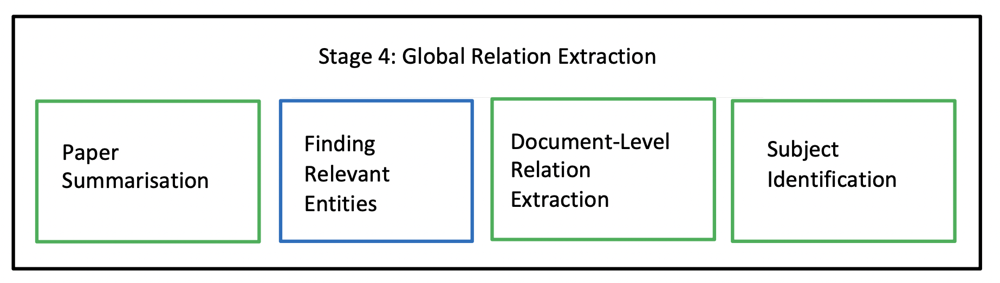
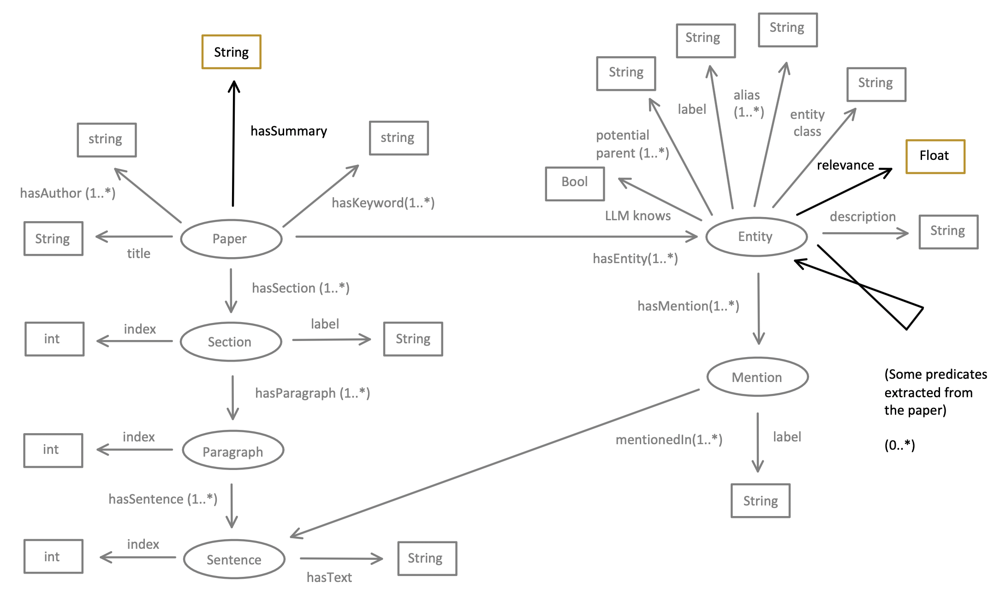

# Stage IV: Global Relation Extraction

## Algorithm

The general pattern for global relation extraction is to perform a pairwise check of any possible pair of entities and determine if there is a potential relation between them, given the context of the whole document. However, checking every possible pair can be computationally expensive. Therefore, our algorithm selects only the top 10% of relevant entities in the paper. Even so, $O((0.1 \cdot n)^2)$ can still scale poorly for long papers. To address this, we cap the maximum number of entities involved in global relation extraction at 20.

To assess the relevance of each entity so that they can be ranked, the algorithm compares the embeddings between the entity and the paper.

Since a whole paper can potentially exceed the context limit of the LLM for both encoders and decoders, the algorithm first shrinks the document based on the assumption that the first and last parts of a paper are always the most important. The goal of shrinking is to retain the original content as much as possible while ensuring the document fits within the LLM's context window. Therefore, the algorithm prompts the LLM decoder to summarize sections starting from the middle and moving toward the abstract and conclusion. If the updated paper is still too long, another iteration is performed.

Once the updated paper fits within an LLM encoder, the embedding of the paper can be obtained by calling an LLM encoder. We chose the encoder M3 instead of BGE due to M3's larger context limit of 8196 tokens. However, we used BGE for coreference resolution because BGE is specialized in generating embeddings of English text, whereas M3 is multilingual, and our datasets are all in English.

For relation extraction, the algorithm loops through each possible pair within the most relevant entities. In each iteration, the label, potential parent types, and description are provided to the LLM. Additionally, the paper's title, keywords, authors, and updated content are given. The output from the LLM is the most relevant predicate between them.

However, in practice, we found that even though the LLM can output a predicate between two entities, it often fails to correctly identify the subject and object within the relation. Therefore, we perform another set of LLM calls, providing the label, potential parent types, and description of both entities along with their predicate. The LLM is tasked with identifying the subject based on the given information.


*Figure 1: Stage 4: Global Relation Extraction*


*Figure 2: Input and Output*

The general picture of Stage 4 is shown in Figure 1, while the input and output are depicted in Figure 2. The input is marked in grey, and the output is marked in color. The algorithm for Stage 4 is as follows:

```plaintext
Algorithm:
Input: An intermediate KG with some predicates connecting the entities.
Output: An intermediate KG with more predicates connecting the entities.

# Paper Summarization
While the paper's length exceeds the token limit:
    From the middle section to the first and last sections of the paper:
        [LLaMA Prompt_1] Ask the LLM to summarize the section to half its original length.
        If the updated paper is below the token limit:
            break.

# Finding Relevant Entities
[M3] Embed all entities based on their label, potential parent types, and description.
[M3] Embed the updated paper.
For each entity in the KG:
    Compute the similarity score between the entity and the paper.
    Store it as a new attribute under the entity.

Get the top 10% of the most relevant entities or the top 20 relevant entities into a list called `relevant_entities`.

# Global Relation Extraction
For entity_1 in relevant_entities:
    For entity_2 in relevant_entities:
        [LLaMA Prompt_2] Using the paper’s title, authors, keywords, and updated content, along with the label, description, and potential parent types of both entities, ask the LLM to return at most one predicate between these two entities.

# Subject Identification
For each newly extracted predicate of a relevant entity pair:
    [LLaMA Prompt_3] Using the label, description, and potential parent types of both entities, plus the previously identified predicate, ask the LLM to determine the subject in this relation.

# Tidy Up
Move all triples to the paper level.
Remove redundant triples where the subject, predicate, and object are identical.
```

## Prompts

### Prompt 1: Paper Summarization
```plaintext
## Task
You are a linguistic expert involved in a text summarization task. Given the text in the **Input** section below, your job is to summarize it to half its original length while retaining key information and ideas.

## Input
## Output
```

### Prompt 2: Global Relation Extraction
```plaintext
## Task Definition
You are a linguistic expert involved in a relation extraction task for finding the relationship between the terms "{term_1}" and "{term_2}" in an academic paper. Given the title, authors, keywords, and content of the paper, as well as the types and descriptions of each term, your task is to extract the **most important** predicate that connects "{term_1}" and "{term_2}".

## Output Format

### Paper
**Title**: {title}
**Keywords**: {keywords}
**Authors**: {authors}
**Content**: {content}

### Term 1: {term_1} ...
### Term 2: {term_2} ...
**Output**:
```

### Prompt 3: Subject Identification
```plaintext
## Task Definition
You are a linguistic expert involved in a subject identification task. Given the terms "{subject_label}" and "{object_label}" related by the predicate "{predicate}", your task is to determine the subject of this relation. Your answer should be a triple, providing the new order for Term 1 and Term 2.

- Your answer should be based on the labels, types, and descriptions of both terms, the predicate, and your common knowledge.
- You should also check if the predicate is active or passive to determine the subject.
- Consider whether "{subject_label} {predicate} {object_label}" is more fluent than "{object_label} {predicate} {subject_label}".

## Output Format ...
## Input ...
## Output ...
```

## Assumptions, Decisions Made, and Limitations

During the implementation, we assumed that the relations returned by the LLM indeed exist in the document. However, we found that this was not always the case. The LLM (LLaMA) suffered from significant hallucination issues at this stage. That is, for each relevant entity pair, the LLM always returned predicates, even if no actual relation existed between them, despite explicitly stating in the prompt that "at most one" predicate should be returned.

Initially, we allowed the LLM to return any number of predicates found in the document. However, we discovered that only the first one or two predicates were usually correct, while the rest were simply "filling in the numbers." Therefore, we decided to allow only one predicate to be returned between any two entities, ensuring that the LLM focused on the most likely predicate.

We also considered an additional verification layer where the LLM would check whether a relation actually existed in the paper. However, this layer was removed because even a simple "Yes" or "No" response could be a hallucination.

Since only one predicate is returned, the limitation is that if multiple predicates exist between two entities, the pipeline will miss most of them.

## Complexity Analysis

The complexity of this stage is modeled as $O(L + \max(20^2, (0.1 \cdot E)^2) + R_2)$, where:
- $L$ is the paper length,
- $E$ is the number of entities,
- $R_2$ is the number of triples extracted in Stage 4.

The summarization process generally completes within one epoch, making it $O(L)$. The global relation extraction complexity depends on the number of entities, leading to $O(\max(20^2, (0.1 \cdot E)^2))$. Finally, subject identification adds $O(R_2)$.