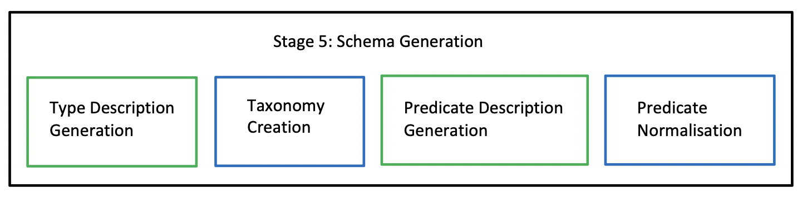
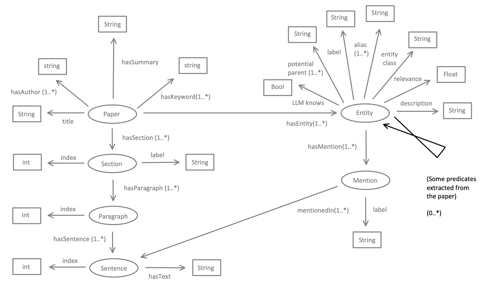

# Stage V: Schema Generation

## Algorithm

There are two main parts to creating a concrete schema for the knowledge graph (KG). One is constructing a taxonomy for the entities within the KG, and the other is normalizing predicates.

The first part creates a hierarchy of supertype and subtype relationships among all entities in the KG. For example:

- ("ANU", "has a broader term", "Public University")
- ("Public University", "has a broader term", "University")

as long as "ANU", "Public University", and "University" exist as entities in the KG. This structure essentially forms a directed acyclic graph. Some of these hierarchical relationships may have already been identified in Stage 3: Local Relation Extraction and Stage 4: Global Relation Extraction. However, this stage focuses solely on hierarchical relations to enhance the completeness of the KG.

The second part merges predicates that have the same meaning, reducing redundancy in the KG. For instance:

- ("ANU", "located in", "Canberra")
- ("ANU", "is in", "Canberra")

These predicates refer to the same relationship and can be merged to eliminate redundant triples.

The high-level pattern of the algorithm in this stage is similar to Stage 2: Entity Disambiguation and Coreference Resolution. In the taxonomy construction part, the goal is to find a matching parent entity in the KG for each potential parent type so that an edge labeled "has a broader term" or "skos:broader" is established between an entity and its parent entity. Before this stage, the potential parent types exist only as strings, and this stage matches some of them to actual entities in the KG.

The algorithm begins by gathering potential parent types for all entities into a Python dictionary, where the key is the name of the potential parent. We assume that these potential parent types are unambiguous because entity types are generally broad concepts, making them unlikely to have multiple distinct meanings. This assumption aligns with one made during Entity Disambiguation in Stage 2.

Using the parent-type dictionary, the algorithm prompts the LLM to generate a description of each type without any additional context. Since these types are general, we assume the LLM can recognize all of them. After generating descriptions, we embed the parent types using their labels and descriptions, as well as embedding all entities in the KG. For each entity and each potential parent type, the algorithm retrieves the embedding of the parent type from the dictionary and compares it with all other entities in the KG. If a potential parent type is highly similar to an existing entity in the KG based on embeddings, we establish a "skos:broader" relationship between them. Once the taxonomy graph is created, we perform a basic consistency check by removing any loops in the directed acyclic graph using the Depth-First Search Algorithm.

For predicate normalization, the approach is similar to coreference resolution. However, we do not merge predicates solely based on their labels, as the meaning of a predicate can vary significantly depending on the context. For example:

- ("Amy", "run", "a business")
- ("Amy", "run", "a marathon")

The verb "run" has different meanings in these cases. To handle this, we take a more conservative approach by first generating a description of the predicate based on the triple, then embedding the predicate, and finally merging predicates if their embeddings are found to be similar.

After predicate normalization, the number of predicates is fixed, and each predicate is assigned an IRI. Finally, we eliminate any duplicate triples where the subject IRI, object IRI, and predicate IRI are identical.

The general process of Stage 5 is illustrated in Figure \ref{sg:fig:simple-view}, while the input and output are shown in Figure \ref{sg:fig:input-output}. The input elements are marked in gray, while the output elements are highlighted in color. The ontology of the KG remains unchanged, but additional hierarchical relationships are introduced, and the number of predicates is reduced.


*Figure \ref{sg:fig:simple-view}: Stage 5: Schema Generation*


*Figure \ref{sg:fig:input-output}: Input and Output*

The algorithm for Stage 5 is as follows:

# Algorithm

## Input
An intermediate Knowledge Graph (KG) with some predicates and some (entity, predicate, entity) triples.

## Output
An intermediate KG with fewer predicates and more (entity, predicate, entity) triples.

## Gathering Types

- Create a dictionary named `type_dict` for storing potential parent types for all entities.
- For each entity in the KG:
  - For each potential parent type of the entity:
    - Add it to `type_dict`.

## Generating Type Descriptions

- For each type in `type_dict`:
  - **[LLaMA Prompt_1]** asks the LLM to generate a general description based on its common knowledge.

## Embedding Types and Entities

- **[BGE]** Embed all types in `type_dict` based on their labels and descriptions.
- **[BGE]** Embed all entities in the KG based on their labels and descriptions.

## Finding Parent Entities

- For `entity_1` in the KG:
  - For each potential parent type of `entity_1`:
    - Retrieve the embedding of the potential parent type from `type_dict`.
    - For `entity_2` in the KG:
      - Compute the cosine similarity between the embedding of the potential parent type and the embedding of `entity_2`.
      - If the similarity > 0.95:
        - Draw a temporary, directed edge between `entity_1` and `entity_2`.

## Removing Cycles

- Use Depth-First Search (DFS) to remove cycles in the subgraph created by the temporary links.
- Add the updated temporary links into the KG.

## Predicate Normalization

- The KG now contains a list of (Entity IRI, predicate name, Entity IRI) triples.

## Generating Descriptions for Predicates

- For each triple in the KG:
  - **[LLaMA Prompt_2]** asks the LLM to generate a general description for the predicate.
  - Store the description directly after the triple, effectively making it a 4-tuple.

## Embedding Predicates

- **[BGE]** Embed the predicate of all triples based on their labels.
- Store the embedding directly after the triple, effectively making it a 5-tuple.

## Finding Relevant Predicates

- For `triple_1` in the KG:
  - For `triple_2` in the KG:
    - Retrieve the embeddings of the predicates of `triple_1` and `triple_2`.
    - Compute their cosine similarity.
    - If the similarity is over 0.95:
      - Draw a temporary link between these two triples.

## Predicate Resolution

- For each triple in the KG:
  - Extract the predicate and build a predicate graph.
  - Maintain a mapping between the predicate in the triple and the node in the predicate graph.
- Use a modified Bron-Kerbosch algorithm to find all disjoint maximal cliques in the predicate graph.
- For each clique of predicates:
  - Group them into a single predicate.
  - Choose a representative name for the predicate.
  - Assign a unique IRI for the predicate.
- Update each triple from (Entity IRI, predicate name, Entity IRI) to (Entity IRI, Predicate IRI, Entity IRI).
- Remove any redundant predicates with identical IRIs.

---

# Prompts

## Prompt 1: Type Description Generation

```plaintext
## Task
You are a linguistic expert involved in writing a description for the term "{label}" found in a paper. Based on your background knowledge, write a single-sentence description that precisely defines the entity or concept that "{label}" refers to.

## Output Format ...
## Input ...
## Output ...
```

## Prompt 2: Predicate Description Generation

```plaintext
## Task
You are a linguistic expert involved in writing a general description for the predicate "{predicate}" in (subject, predicate, object) triples like "({subject}, {predicate}, {object})".

- Your description should be general and not tied to a specific instance of the given triple.
- The provided triple is only to help you understand the predicate's usage.
- Your description should explain how the predicate connects the subject and object in a general sense.

## Output Format ...
## Input ...
## Output ...
```

---

# Assumptions

Key assumptions made in this stage:

1. When grouping potential parent types into a dictionary, we assume that type labels are sufficient for representation.
2. When generating descriptions for parent types, we assume that the LLM has the necessary background knowledge, similar to predicate descriptions.

---

# Limitations

Several limitations exist in this stage:

1. Potential parent types are determined before coreference resolution, meaning they may not be highly accurate due to limited context.
2. Descriptions generated for types and predicates may not fully capture their meaning and could be lossy.
3. Embeddings for types and predicates may not fully represent their meanings, potentially leading to information loss.
4. Cosine similarity does not account for vector length, which can introduce errors when determining parent entities or similar predicates.
5. The aggressive approach to linking entities or predicates (based on a threshold) improves efficiency but may lead to more errors.
6. When merging predicates, the algorithm does not include an extra step to determine the most representative predicate name.

---

# Complexity Analysis

The complexity of this stage is modeled as \(O(E + R)\), where:

- \(E\) is the number of entities.
- \(R\) is the total number of predicates (triples) after local and global relation extraction.

Although each entity may have several potential types, many types are shared among multiple entities (e.g., "ANU" and "USYD" are both "Universities"), so we approximate the complexity as \(O(E)\). Additionally, calling the LLM to generate descriptions introduces another \(O(E)\) term, leading to an overall complexity of \(O(E + R)\).

---

# Design Decisions

Some design choices in this stage resemble those in **Stage 3: Entity Disambiguation and Coreference Resolution**, including:

- Using descriptions for generating embeddings.
- Using disjoint maximal cliques to group related predicates.

A key difference is the removal of the double-checking mechanism when finding similar parent entities or predicates. This reduces complexity but may lower precision. However, recall may improve since the double-checking mechanism and LLM outputs can be overly conservative. To prioritize precision over recall, we increased the similarity threshold from 0.9 to 0.95.