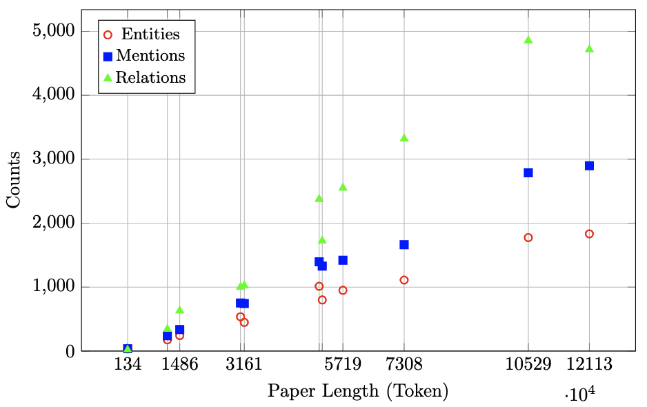
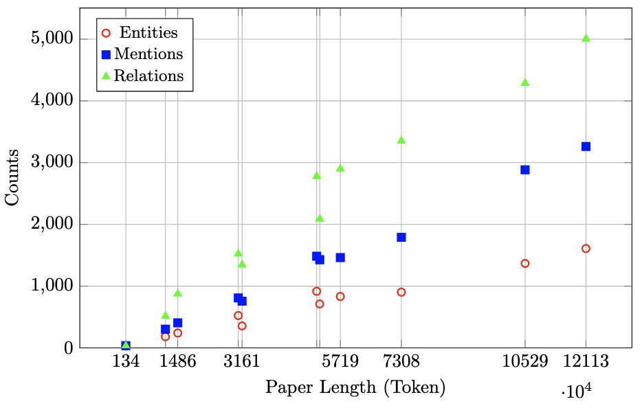

# Visualised Results

### General Metrics (LLaMA)

### General Metrics (GPT)

### Runtime and Expense vs. Paper Length

### Score for Reverse Engineering vs. Paper Length

### Boxplot of the Scores for RAG Test

